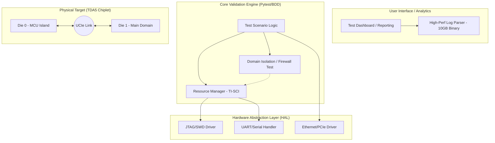
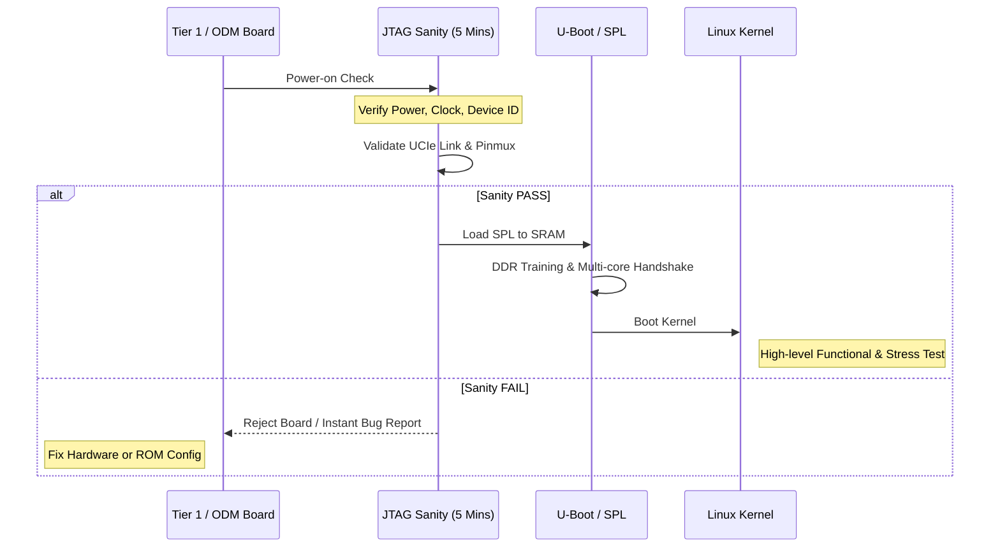

# PROPOSAL: STRATEGIC VALIDATION FRAMEWORK
**Platform:** TI TDA5 (Jacinto 7 Architecture)  
**Focus:** Integration, Bring-up & System Reliability  
**Status:** Draft for Management Review

---

## 1. Executive Summary
This proposal outlines a **Lean Validation Framework** for the company’s first AC project. Given the "Black-box" nature of internal die functions, the framework shifts focus toward **Inter-die Connectivity** and **System-level Integrity**. The goal is to minimize manual effort while ensuring the platform meets the high-reliability standards of the automotive industry.

---

## 2. Validation Architecture (Overview)

The framework is built on a 4-layer modular architecture to decouple hardware dependencies and maximize test case reuse across different board iterations.

---

## 3. The "Lean & Mean" Bring-up Strategy

To meet the management goal of the fastest path to a Linux Kernel, we implement a **Gatekeeper Model** to catch hardware/firmware issues early before deep-diving into OS-level testing.

---

## 4. Key Technical Focus Areas (Critical Path)

| Area | Validation Method | Objectives |
| :--- | :--- | :--- |
| **Connectivity** | JTAG / Register Access | Validate Pinmux, PADCONFIG, and UCIe Physical Link training. |
| **Boot Sequence** | UART Log / JTAG PC Trace | Monitor R5 SPL -> A72 SPL -> ATF -> Linux handover. |
| **Resource Isolation** | Fault Injection (Negative) | Verify Firewalls (MSMC) and Domain Locks (TIFS/DMSC). |
| **Stability** | Linux Stress-ng / Memtester | Test UCIe throughput and DDR stability under thermal load. |

---

## 5. Critical Inputs & Ownership (RACI Matrix)

To prevent "blame-games" during bring-up failures, the following inputs must be formalized and owned by respective teams:

### A. Technical Inputs Required from Design/Arch Teams:
1.  **System Memory Map:** Detailed Inter-die address space (Coherent vs. Non-coherent).
2.  **TI-SCI Protocol Specs:** List of Device/Clock IDs for DMSC resource control.
3.  **Firewall & Domain Specs:** Definition of PrivIDs and access permission matrices.

### B. Responsibility Assignment (RACI):

| Task | Validation Team | Design/Arch | Tier 1 / ODM | Manager |
| :--- | :---: | :---: | :---: | :---: |
| Build Framework | **R** (Lead) | C (Consult) | I (Inform) | A (Approve) |
| Provision of Register Maps | I | **R** | C | - |
| HW Board Acceptance | C | I | **R** | A |
| Root Cause Analysis (Boot) | **R** | C | C | I |

---

## 6. Root Cause Analysis (RCA) Kit
To protect the validation team when the board fails to boot, we will deploy an **RCA Kit**:
* **Automated JTAG Scripts:** To scan Boot Mode Pins, Power Rails, and Reset Status.
* **Golden Register Snapshots:** JSON/YAML files to compare actual silicon state vs. design specs.
* **Handshake Monitor:** Traps TI-SCI messages between Dies to identify where the boot flow "hangs."

---

## 7. Business Value & Next Steps

**Value Proposition:**
* **Minimum Effort:** Reduces manual debug time by 70% via automated sanity scripts.
* **Early Detection:** Identifies soldering or silicon issues within 5 minutes of power-on.
* **Future-Proof:** Builds a scalable foundation for all future Chiplet-based automotive projects.

**Next Steps:**
1.  **Approval** for developing the **JTAG Sanity Script** (Minimum Effort phase).
2.  **Formal Request** for the **SoC Memory Map** and **Register Specs** from the Architect team.
3.  **Establish Acceptance Criteria** for Tier 1/ODM board delivery.