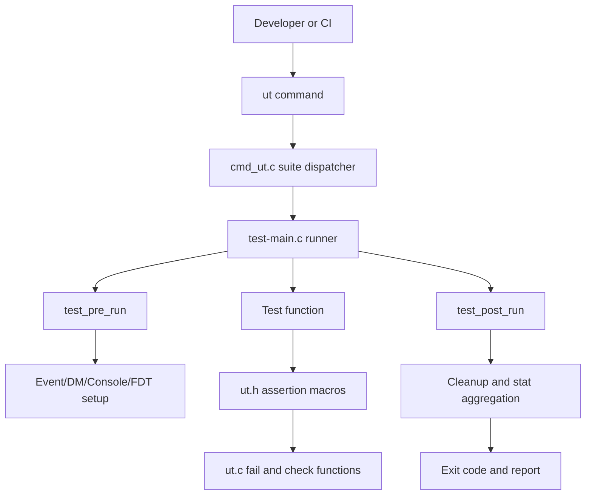
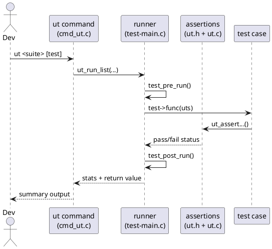
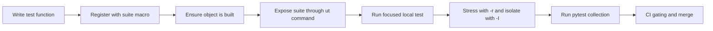
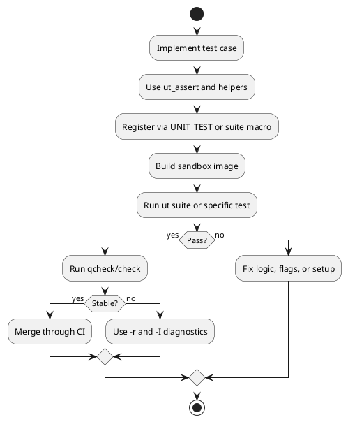

# U-Boot UT How-To (First Principles)

## Scope Clarification

- [u-boot/test/ut.c](u-boot/test/ut.c)

This document explains the C unit-test framework around that module, including architecture, execution flow, system interaction, how to add new tests, and how to automate test execution.

---

## 1) First-Principles View

## 1.1 Why this module exists

The file [u-boot/test/ut.c](u-boot/test/ut.c) is not the complete test runner. It is the low-level assertion and runtime utility layer used by U-Boot C unit tests.

Without this layer, every test suite would need to re-implement:
- failure formatting and counting,
- console-output capture checks,
- memory-leak delta checks,
- output silencing and restoration.

That would make tests inconsistent, harder to maintain, and difficult to automate reliably.

## 1.2 Core problem solved

U-Boot needs fast, deterministic, in-process tests that can validate subsystems (especially sandbox and DM) without external orchestration overhead.

The UT framework provides a stable mechanism to turn test intent into machine-checkable outcomes with standardized reporting and return codes.

## 1.3 Fundamental principles

1. Determinism: identical input should produce identical pass/fail outcomes.
2. Isolation: test state is prepared and cleaned around each run.
3. Minimal runtime overhead: linker-list registration + lightweight macros.
4. Automation compatibility: tests are discoverable and executable by pytest/CI.

---

## 2) System Architecture

## 2.1 Main components

| Component | Responsibility | Key files |
|---|---|---|
| Assertion utilities | Fail reporting, console checks, mem delta checks | [u-boot/test/ut.c](u-boot/test/ut.c), [u-boot/include/test/ut.h](u-boot/include/test/ut.h) |
| Test metadata model | unit_test entries, flags, test state object | [u-boot/include/test/test.h](u-boot/include/test/test.h) |
| Runner core | Pre/post run hooks, DM setup/teardown, list execution | [u-boot/test/test-main.c](u-boot/test/test-main.c) |
| Command bridge | ut command and suite dispatch | [u-boot/test/cmd_ut.c](u-boot/test/cmd_ut.c) |
| Build wiring | Which test objects are built per phase/config | [u-boot/test/Makefile](u-boot/test/Makefile) |
| Pytest bridge | Python-side orchestration and discovery | [u-boot/test/py/tests/test_ut.py](u-boot/test/py/tests/test_ut.py) |

## 2.2 Architectural diagram (Mermaid)



## 2.3 Sequence diagram (PlantUML)



---

## 3) Data and Execution Workflow

## 3.1 Core data structures

- struct unit_test
  - static metadata for each test entry (name, flags, function pointer).
- struct unit_test_state
  - runtime state across a run (stats, FDT mode, buffers, options).
- struct ut_stats
  - fail_count, skip_count, test_count, timing metrics.

Defined in:
- [u-boot/include/test/test.h](u-boot/include/test/test.h)

## 3.2 End-to-end lifecycle

1. User invokes ut command.
2. Suite resolves to linker-list segment.
3. ut_run_list initializes state and validates prerequisites.
4. For each test:
   - test_pre_run configures environment,
   - test function executes,
   - assertions in ut.h call helper functions in ut.c,
   - test_post_run restores state.
5. Runner aggregates stats and returns process status.

## 3.3 Runtime cost model

If N tests are selected and each test runs r times:

$$
T_{total} \approx \sum_{i=1}^{N}\left(T_{setup,i} + r\cdot T_{body,i} + T_{cleanup,i}\right)
$$

DM-heavy tests increase setup/cleanup cost, but improve isolation and reproducibility.

---

## 4) How UT Interacts with U-Boot Subsystems

## 4.1 Console subsystem

- ut_check_console_line and related APIs parse console-recorded output.
- Requires UTF_CONSOLE and console recording setup in pre-run.
- Enables strict behavior verification for command tests.

Relevant file:
- [u-boot/test/ut.c](u-boot/test/ut.c)

## 4.2 Driver Model (DM)

- UTF_DM activates DM-specific pre/post logic.
- Runner rebuilds DM state to avoid test pollution.
- Tests can run in both live tree and flat tree paths.

Relevant file:
- [u-boot/test/test-main.c](u-boot/test/test-main.c)

## 4.3 Global runtime and flags

- Failure helpers clear silent/record flags before printing.
- Runner interacts with event framework, cyclic handlers, bloblist, blkcache.
- This protects subsequent tests from stale global state.

## 4.4 Linker-list and command dispatch integration

- UNIT_TEST macro emits linker-list entries.
- cmd_ut.c maps command suites to linker-list ranges.
- test/Makefile controls whether suite objects are linked.

## 4.5 Existing UT suites and representative test cases

At this source snapshot, the normal `ut` command declares 26 top-level suites in [u-boot/test/cmd_ut.c](u-boot/test/cmd_ut.c). Actual runtime availability is still config-dependent, since a suite can exist in the dispatcher while its linker-list range is empty in a particular build.

The table below is intentionally representative, not exhaustive. It shows real test cases that already exist in the tree and are useful as reference points when adding or debugging UT coverage.

| Suite | Main focus | Representative existing test cases | Key source files |
|---|---|---|---|
| addrmap | addrmap command behavior | `addrmap_test_basic` | [u-boot/test/cmd/addrmap.c](u-boot/test/cmd/addrmap.c) |
| bdinfo | board-info output validation | `bdinfo_test_full`, `bdinfo_test_help`, `bdinfo_test_memory` | [u-boot/test/cmd/bdinfo.c](u-boot/test/cmd/bdinfo.c) |
| bloblist | bloblist core logic and CLI | `bloblist_test_init`, `bloblist_test_checksum`, `bloblist_test_cmd_list` | [u-boot/test/common/bloblist.c](u-boot/test/common/bloblist.c) |
| bootm | `bootm` parameter substitution and silent behavior | `bootm_test_nop`, `bootm_test_silent`, `bootm_test_subst_both` | [u-boot/test/boot/bootm.c](u-boot/test/boot/bootm.c) |
| bootstd | standard boot, bootflow, bootdev, bootmeth, expo, cedit, VBE | `bootflow_cmd`, `bootdev_test_cmd_list`, `bootmeth_cmd_list`, `expo_base`, `cedit_base`, `vbe_simple_test_base` | [u-boot/test/boot/bootflow.c](u-boot/test/boot/bootflow.c), [u-boot/test/boot/bootdev.c](u-boot/test/boot/bootdev.c), [u-boot/test/boot/bootmeth.c](u-boot/test/boot/bootmeth.c), [u-boot/test/boot/expo.c](u-boot/test/boot/expo.c), [u-boot/test/boot/cedit.c](u-boot/test/boot/cedit.c), [u-boot/test/boot/vbe_simple.c](u-boot/test/boot/vbe_simple.c) |
| cmd | generic command behavior outside dedicated suites | `command_test`, `cmd_test_qfw_list`, `cmd_test_cpuid`, `net_test_wget` | [u-boot/test/cmd/command.c](u-boot/test/cmd/command.c), [u-boot/test/cmd/qfw.c](u-boot/test/cmd/qfw.c), [u-boot/test/cmd/cpuid.c](u-boot/test/cmd/cpuid.c), [u-boot/test/cmd/wget.c](u-boot/test/cmd/wget.c) |
| common | common/ helpers, CLI input, printing, events, autoboot | `test_event_base`, `cread_test`, `print_printf`, `test_autoboot` | [u-boot/test/common/event.c](u-boot/test/common/event.c), [u-boot/test/common/cread.c](u-boot/test/common/cread.c), [u-boot/test/common/print.c](u-boot/test/common/print.c), [u-boot/test/common/test_autoboot.c](u-boot/test/common/test_autoboot.c) |
| dm | Driver Model subsystems and command integration | `dm_test_rtc_set_get`, `dm_test_mmc_base`, `dm_test_iommu`, `dm_test_dma`, `dm_test_virtio_rng_check_len` | [u-boot/test/dm/rtc.c](u-boot/test/dm/rtc.c), [u-boot/test/dm/mmc.c](u-boot/test/dm/mmc.c), [u-boot/test/dm/iommu.c](u-boot/test/dm/iommu.c), [u-boot/test/dm/dma.c](u-boot/test/dm/dma.c), [u-boot/test/dm/virtio_rng.c](u-boot/test/dm/virtio_rng.c) |
| env | environment storage, attributes, hash table, FDT import | `env_test_env_cmd`, `env_test_attrs_lookup`, `env_test_htab_fill`, `env_test_fdt_import` | [u-boot/test/env/cmd_ut_env.c](u-boot/test/env/cmd_ut_env.c), [u-boot/test/env/attr.c](u-boot/test/env/attr.c), [u-boot/test/env/hashtable.c](u-boot/test/env/hashtable.c), [u-boot/test/env/fdt.c](u-boot/test/env/fdt.c) |
| exit | shell exit semantics and return-code propagation | `cmd_exit_test` | [u-boot/test/cmd/exit.c](u-boot/test/cmd/exit.c) |
| fdt | `fdt` command behavior across addressing, mutation, query, apply | `fdt_test_addr`, `fdt_test_get_value`, `fdt_test_set`, `fdt_test_apply` | [u-boot/test/cmd/fdt.c](u-boot/test/cmd/fdt.c) |
| fdt_overlay | overlay merge and phandle handling | `fdt_overlay_test_change_int_property`, `fdt_overlay_test_add_node_by_path`, `fdt_overlay_test_stacked` | [u-boot/test/fdt_overlay/cmd_ut_fdt_overlay.c](u-boot/test/fdt_overlay/cmd_ut_fdt_overlay.c) |
| font | font command and rendering path | `font_test_base` | [u-boot/test/cmd/font.c](u-boot/test/cmd/font.c) |
| hw | hardware validation through a thin HAL boundary | `hw_test_smoke` | [u-boot/test/hw/suites/hw_smoke.c](u-boot/test/hw/suites/hw_smoke.c), [u-boot/include/test/hw.h](u-boot/include/test/hw.h) |
| hush | shell language semantics | `hush_test_if_base`, `hush_test_simple_dollar`, `hush_test_for`, `hush_test_and_or` | [u-boot/test/hush/if.c](u-boot/test/hush/if.c), [u-boot/test/hush/dollar.c](u-boot/test/hush/dollar.c), [u-boot/test/hush/loop.c](u-boot/test/hush/loop.c), [u-boot/test/hush/list.c](u-boot/test/hush/list.c) |
| lib | low-level library code, crypto, Unicode, string/memory, compression | `lib_test_lmb_simple`, `lib_rsa_verify_valid`, `unicode_test_utf8_get`, `compression_test_gzip`, `lib_test_sha256_hmac` | [u-boot/test/lib/lmb.c](u-boot/test/lib/lmb.c), [u-boot/test/lib/rsa.c](u-boot/test/lib/rsa.c), [u-boot/test/lib/unicode.c](u-boot/test/lib/unicode.c), [u-boot/test/lib/compression.c](u-boot/test/lib/compression.c), [u-boot/test/lib/test_sha256_hmac.c](u-boot/test/lib/test_sha256_hmac.c) |
| loadm | `loadm` argument parsing and memory-blob loading | `loadm_test_params`, `loadm_test_load` | [u-boot/test/cmd/loadm.c](u-boot/test/cmd/loadm.c) |
| log | log formatting, disabled logging, syslog, continuation semantics | `log_test_cont`, `log_test_nolog_err`, `log_test_syslog_err`, `log_test_pr_cont` | [u-boot/test/log/cont_test.c](u-boot/test/log/cont_test.c), [u-boot/test/log/nolog_test.c](u-boot/test/log/nolog_test.c), [u-boot/test/log/syslog_test.c](u-boot/test/log/syslog_test.c), [u-boot/test/log/pr_cont_test.c](u-boot/test/log/pr_cont_test.c) |
| mbr | `mbr` command execution path | `mbr_test_run` | [u-boot/test/cmd/mbr.c](u-boot/test/cmd/mbr.c) |
| measurement | TPM-based measured boot | `measure` | [u-boot/test/boot/measurement.c](u-boot/test/boot/measurement.c) |
| mem | memory copy/search commands | `mem_test_cp_b`, `mem_test_cp_q`, `mem_test_ms_b`, `mem_test_ms_quiet` | [u-boot/test/cmd/mem_copy.c](u-boot/test/cmd/mem_copy.c), [u-boot/test/cmd/mem_search.c](u-boot/test/cmd/mem_search.c) |
| optee | OP-TEE device-tree fix-up helpers | `optee_fdt_copy_empty`, `optee_fdt_copy_prefilled`, `optee_fdt_copy_already_filled` | [u-boot/test/optee/optee.c](u-boot/test/optee/optee.c) |
| pci_mps | PCIe Maximum Payload Size safety | `test_pci_mps_safe` | [u-boot/test/cmd/pci_mps.c](u-boot/test/cmd/pci_mps.c) |
| seama | SEAMA image command decode path | `seama_test_noargs`, `seama_test_addr`, `seama_test_index` | [u-boot/test/cmd/seama.c](u-boot/test/cmd/seama.c) |
| setexpr | integer, regex, string, and format-expression behavior | `setexpr_test_int`, `setexpr_test_regex`, `setexpr_test_str_oper`, `setexpr_test_fmt` | [u-boot/test/cmd/setexpr.c](u-boot/test/cmd/setexpr.c) |
| upl | Universal Payload data model and serialization | `upl_test_base`, `upl_test_info`, `upl_test_read_write`, `upl_test_info_norun` | [u-boot/test/boot/upl.c](u-boot/test/boot/upl.c) |

Concrete commands against existing tests:

```bash
./u-boot -T -c "ut bootm bootm_test_subst_both"
./u-boot -T -c "ut dm dm_test_rtc_set_get"
./u-boot -T -c "ut fdt fdt_test_apply"
./u-boot -T -c "ut hw hw_test_smoke"
./u-boot -T -c "ut hush hush_test_for"
```

## 4.6 Existing SPL/XPL-only UT cases

Not all UT coverage is exposed through the normal `ut` top-level command. When building SPL/XPL with the corresponding config options, [u-boot/test/image/](u-boot/test/image/) contributes a separate family of image-loading tests.

Representative existing SPL-oriented test families include:

| Family | Coverage | Representative registrations | Source files |
|---|---|---|---|
| core image parsing | SPL image-header parse/load behavior | `spl_test_image` over `LEGACY`, `IMX8`, `FIT_INTERNAL`, `FIT_EXTERNAL` | [u-boot/test/image/spl_load.c](u-boot/test/image/spl_load.c) |
| filesystem loaders | ext/fat and block-backed image load | `spl_test_ext`, `spl_test_fat`, `spl_test_blk`, `spl_test_mmc` | [u-boot/test/image/spl_load_fs.c](u-boot/test/image/spl_load_fs.c) |
| flash/network media | NOR, NAND, SPI, network load paths | `spl_test_nor`, `spl_test_nand`, `spl_test_spi`, `spl_test_net` | [u-boot/test/image/spl_load_nor.c](u-boot/test/image/spl_load_nor.c), [u-boot/test/image/spl_load_nand.c](u-boot/test/image/spl_load_nand.c), [u-boot/test/image/spl_load_spi.c](u-boot/test/image/spl_load_spi.c), [u-boot/test/image/spl_load_net.c](u-boot/test/image/spl_load_net.c) |
| OS handoff | SPL OS-loading path | `spl_test_load` | [u-boot/test/image/spl_load_os.c](u-boot/test/image/spl_load_os.c) |

These tests are important because they validate the same linker-list + assertion model in a different build phase, where command availability and init sequencing differ from the normal sandbox `ut` flow.

---

## 5) How to Create a New Test

## 5.1 Add to an existing suite

Example pattern:

```c
static int bootm_test_new_case(struct unit_test_state *uts)
{
    ut_assertok(run_command("echo hello", 0));
    return 0;
}
BOOTM_TEST(bootm_test_new_case, UTF_CONSOLE);
```

Steps:
1. Pick the existing suite file (for example [u-boot/test/boot/bootm.c](u-boot/test/boot/bootm.c)).
2. Add test function with assertions.
3. Register with suite macro.
4. Build and run targeted test first.

## 5.2 Create a new suite

1. Create a new source file under test or test subdirectory.
2. Define suite wrapper macro:

```c
#define WIBBLE_TEST(_name, _flags) UNIT_TEST(_name, _flags, wibble_test)
```

3. Register tests with WIBBLE_TEST.
4. Add suite declaration in [u-boot/test/cmd_ut.c](u-boot/test/cmd_ut.c):
   - SUITE_DECL(wibble)
   - SUITE(wibble, "purpose text")
5. Add object to the relevant Makefile.

## 5.3 Choosing flags correctly

Common flags from [u-boot/include/test/test.h](u-boot/include/test/test.h):
- UTF_CONSOLE: needs console capture/checks.
- UTF_DM: needs DM reset lifecycle.
- UTF_SCAN_FDT: requires FDT scan before test body.
- UTF_MANUAL: only runs with force option and must use _norun suffix.

## 5.4 Naming and discoverability

Recommended naming pattern:
- <suite>_test_<case>

Why it matters:
- command filtering,
- pytest discovery logic,
- debugging and CI triage readability.

---

## 6) Automation Strategy

## 6.1 Local fast loop

Run all suites:

```bash
./u-boot -T -c "ut all"
```

Run one suite:

```bash
./u-boot -T -c "ut dm"
```

Run one test:

```bash
./u-boot -T -c "ut dm dm_test_gpio"
```

Race/stability stress:

```bash
./u-boot -T -c "ut dm -r100 dm_test_rtc_set_get"
```

Isolate order-dependent failures:

```bash
./u-boot -T -c "ut dm -I82:dm_test_host"
```

## 6.2 Pytest and CI integration

General test command:

```bash
make check
```

Quick subset:

```bash
make qcheck
```

Reference docs:
- [u-boot/doc/develop/testing.rst](u-boot/doc/develop/testing.rst)
- [u-boot/doc/develop/tests_sandbox.rst](u-boot/doc/develop/tests_sandbox.rst)
- [u-boot/doc/develop/tests_writing.rst](u-boot/doc/develop/tests_writing.rst)

## 6.3 Recommended CI pipeline

1. Sanity stage
   - ut info
   - smoke suites: dm, bootstd, bootm
2. Core sandbox stage
   - ut all with test DT
3. Pytest stage
   - per-commit: make qcheck
   - nightly/mainline gate: make check
4. Stability stage
   - targeted -rN for historically flaky tests

---

## 7) New-Test and Automation Flow Diagrams

## 7.1 Mermaid flow



## 7.2 PlantUML flow



---

## 8) Practical Checklist

- Use consistent test naming.
- Keep test intent narrow and deterministic.
- Select UTF flags carefully.
- Use UTF_CONSOLE for output-verification tests.
- Use UTF_DM where state isolation is required.
- For manual checker tests, add UTF_MANUAL and _norun suffix.
- Always validate on sandbox test DT before pushing CI.

---

## 9) Key Source References

- [u-boot/test/ut.c](u-boot/test/ut.c)
- [u-boot/include/test/ut.h](u-boot/include/test/ut.h)
- [u-boot/include/test/test.h](u-boot/include/test/test.h)
- [u-boot/test/test-main.c](u-boot/test/test-main.c)
- [u-boot/test/cmd_ut.c](u-boot/test/cmd_ut.c)
- [u-boot/test/Makefile](u-boot/test/Makefile)
- [u-boot/test/py/tests/test_ut.py](u-boot/test/py/tests/test_ut.py)
- [u-boot/doc/develop/testing.rst](u-boot/doc/develop/testing.rst)
- [u-boot/doc/develop/tests_writing.rst](u-boot/doc/develop/tests_writing.rst)
- [u-boot/doc/develop/tests_sandbox.rst](u-boot/doc/develop/tests_sandbox.rst)
