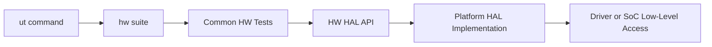
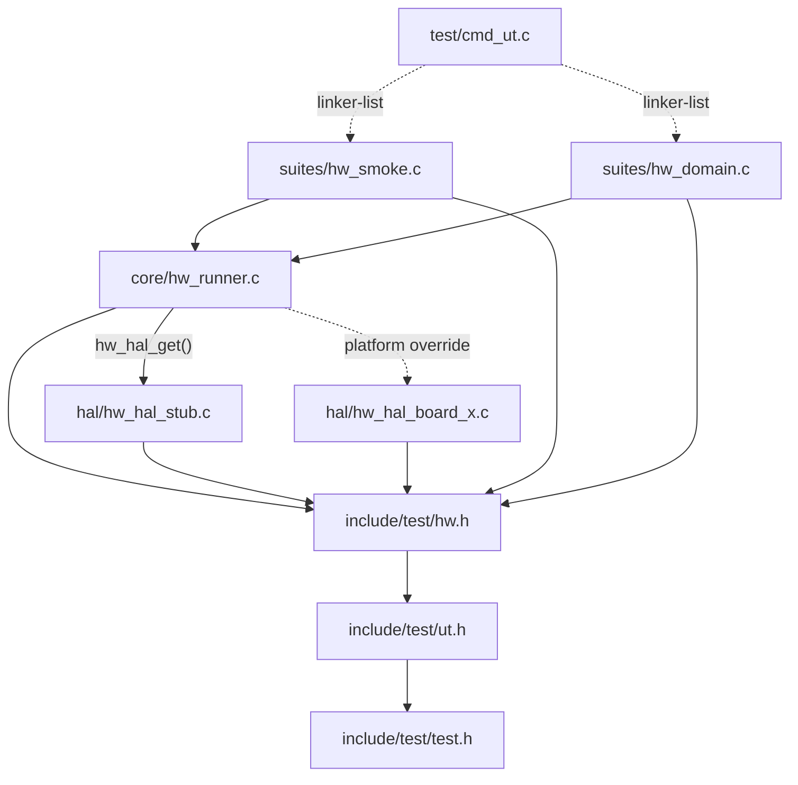
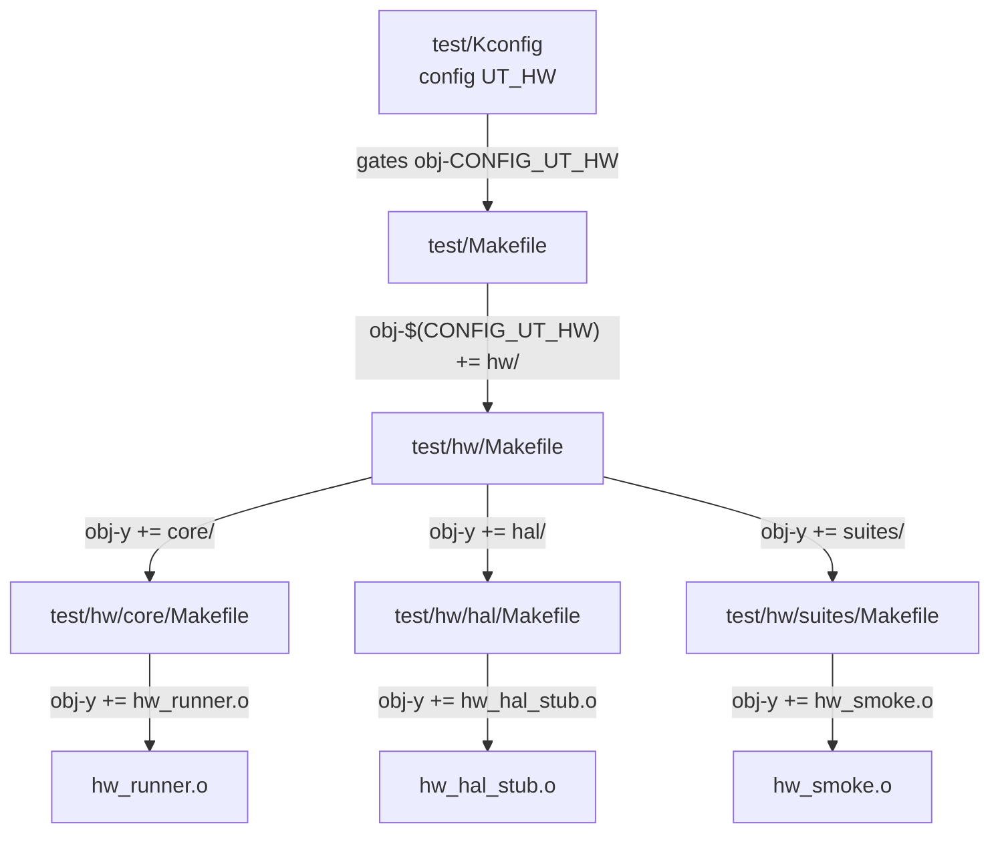
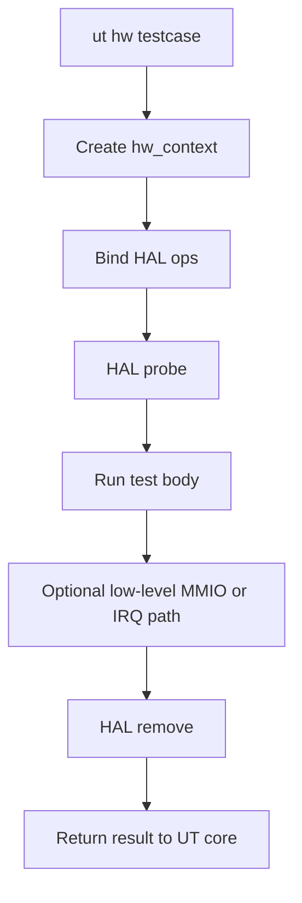

# U-Boot HW Test Design (First Principles)
### Why this is the right level of design

- reuse tối đa hạ tầng `ut` hiện có,
- giữ code HW được cô lập trong `test/hw/`,
- dùng một lớp HAL mỏng để hấp thụ khác biệt platform,
- vẫn cho phép truy cập low-level như MMIO, IRQ, clock, reset khi cần,
- tránh tạo thêm framework overhead vượt quá phạm vi bài toán.

### What this design gives the team

- một điểm vào nhất quán: `ut hw <testcase>`,
- một boundary rõ giữa test logic và platform implementation,
- một mô hình dễ mở rộng theo domain như GPIO, I2C, SPI, reset, clock,
- một kiến trúc đủ nhỏ để maintain nhưng đủ mạnh để đi xuống hardware level.

### What this design does not try to do

- không thay thế `ut`,
- không tạo command/test engine mới,
- không xây dựng capability framework tổng quát,
- không tối ưu cho mọi kiểu test ngoài hardware validation.

### Executive recommendation

Tiếp tục đầu tư theo hướng `ut hw + HAL mỏng`. Chỉ mở rộng abstraction khi xuất hiện pain thực tế từ multi-platform lifecycle, fixture orchestration, hoặc observability ở quy mô lớn.

## 1) Role

`hw` là một sub-suite của `ut`, có vai trò chuyên trách cho hardware validation.

Điểm vào của nó là:

```text
ut hw <testcase>
```

Phần code chuyên biệt được gom vào:

```text
test/hw/
```

Phương trình kiến trúc của mô hình này là:

>**HW Test = UT Core + HAL Boundary + HW Suites**

Vai trò của từng phần:

- `UT Core`: registration, assert, reporting, suite dispatch, lifecycle cơ bản.
- `HAL Boundary`: cách ly platform-specific low-level access khỏi test logic chung.
- `HW Suites`: nơi mô tả test intent cho GPIO, I2C, SPI, reset, clock, MMIO, IRQ.

---

## 2) Ability

| Khả năng | Cách đạt |
|---|---|
| Reuse tối đa UT | dùng `UNIT_TEST`, `unit_test_state`, `ut_assert`, `ut` dispatcher |
| Giữ code HW cô lập | gom vào `test/hw/` |
| Portability | đưa khác biệt platform xuống HAL |
| Low-level access | cho phép MMIO, IRQ, clock, reset qua HAL ops |
| Dependency thấp | test logic chung không gọi trực tiếp sandbox/private internals |
| Mở rộng theo domain | thêm test file mới trong `test/hw/suites/`, thêm HAL impl mới trong `test/hw/hal/` |
| Debug tốt hơn | chuẩn hóa boundary để có dump và observability nhất quán |

---

## 3) Kiến trúc tổng thể



## 3.1 Phân rã chức năng

- `ut` giữ vai trò test engine.
- `hw suite` là namespace tổ chức testcase.
- `HW HAL API` là boundary duy nhất giữa test logic và platform specifics.
- `Platform HAL Implementation` là nơi chạm xuống driver, register, IRQ, clock, reset.

## 3.2 Nguyên tắc quan trọng

Testcase chung không nói chuyện trực tiếp với:

- `gd` (Global Data),
- sandbox-only helper,
- private driver state,
- board-specific symbols.

Testcase chung chỉ nói chuyện với HAL.

## 3.3 Biểu đồ phụ thuộc module

Chiều mũi tên biểu diễn quan hệ "phụ thuộc vào / includes". Mũi tên nét đứt biểu diễn selection tại build-time hoặc runtime.



Điểm then chốt:

- `include/test/hw.h` là hub trung tâm: mọi module trong `test/hw/` đều phụ thuộc vào nó.
- `hw_runner.c` ràng buộc `unit_test_state` với HAL và quyết định HAL nào được dùng qua `hw_hal_get()`.
- HAL implementations (`stub` hoặc `platform`) được chọn tại build-time, không phải runtime, đảm bảo không có chi phí phụ trội.
- `cmd_ut.c` kết nối đến các testcase qua linker-list mechanism, không include trực tiếp.

---

## 4) File structure đề xuất

```text
test/
  hw/
    Kconfig
    Makefile
    README.md
    core/
      hw_runner.c
    hal/
      hw_hal_stub.c
      hw_hal_sandbox.c
      hw_hal_board_x.c
    suites/
      hw_smoke.c
      hw_gpio.c
      hw_i2c.c
      hw_spi.c
      hw_reset.c
      hw_clock.c
include/
  test/
    hw.h
```

Boundary rule:

- phần lớn code mới phải nằm dưới `test/hw/`,
- public contract tối thiểu nằm ở [u-boot/include/test/hw.h](u-boot/include/test/hw.h),
- ngoài ra chỉ cần hook nhỏ ở [u-boot/test/cmd_ut.c](u-boot/test/cmd_ut.c), [u-boot/test/Kconfig](u-boot/test/Kconfig), [u-boot/test/Makefile](u-boot/test/Makefile).

## 4.1 Chuỗi phụ thuộc Makefile

Sơ đồ dưới đây mô tả cách Kconfig gate kiểm soát toàn bộ build và từng Makefile delegate xuống cấp con.



Giải thích:

- `test/Kconfig` định nghĩa `CONFIG_UT_HW`; khi tắt, toàn bộ cây `test/hw/` bị loại khỏi build.
- `test/Makefile` là điểm duy nhất trong cây gốc cần sửa; chỉ thêm một dòng `obj-$(CONFIG_UT_HW) += hw/`.
- `test/hw/Makefile` fanout xuống ba thư mục con; không có logic điều kiện thêm ở đây.
- Khi thêm HAL mới (ví dụ `hw_hal_sandbox.o`), chỉ cần cập nhật `test/hw/hal/Makefile`.
- Khi thêm suite mới (ví dụ `hw_gpio.o`), chỉ cần cập nhật `test/hw/suites/Makefile`.
- Không có Makefile nào ngoài `test/Makefile` cần thay đổi cho hook gốc.

---

## 5) HAL contract tối thiểu

HAL nên nhỏ, rõ, tập trung vào low-level access thật sự cần cho HW tests.

Ví dụ contract tối thiểu:

```c
struct hw_hal_ops {
    int (*probe)(struct hw_context *ctx);
    void (*remove)(struct hw_context *ctx);
    int (*mmio_read32)(struct hw_context *ctx, phys_addr_t addr, u32 *val);
    int (*mmio_write32)(struct hw_context *ctx, phys_addr_t addr, u32 val);
};
```

Sau này có thể mở rộng dần theo nhu cầu thật:

```c
struct hw_hal_ops {
    int (*probe)(struct hw_context *ctx);
    void (*remove)(struct hw_context *ctx);
    int (*mmio_read32)(struct hw_context *ctx, phys_addr_t addr, u32 *val);
    int (*mmio_write32)(struct hw_context *ctx, phys_addr_t addr, u32 val);
    int (*irq_inject)(struct hw_context *ctx, uint irq);
    int (*clock_enable)(struct hw_context *ctx, const char *name);
    int (*clock_disable)(struct hw_context *ctx, const char *name);
    int (*reset_assert)(struct hw_context *ctx, const char *name);
    int (*reset_deassert)(struct hw_context *ctx, const char *name);
};
```

Nguyên tắc:

- không thêm API “vì có thể sau này cần”,
- chỉ mở rộng HAL khi xuất hiện test case thực sự cần.

---

## 6) Data model đề xuất

```c
struct hw_context {
    struct unit_test_state *uts;
    const struct hw_hal_ops *hal;
    void *platform_priv;
    ulong flags;
};
```

Giải thích:

- `unit_test_state` vẫn là state gốc của framework.
- `hw_context` chỉ là lớp bọc nhỏ cho HW tests.
- `platform_priv` cho phép HAL mang state riêng mà không làm bẩn test logic chung.

---

## 7) Workflow thực thi



Trình tự này giữ lifecycle ngắn và dễ debug hơn mô hình extension nhiều tầng.

---

## 8) Dependency policy

## 8.1 Allowed

- [u-boot/include/test/test.h](u-boot/include/test/test.h)
- [u-boot/include/test/ut.h](u-boot/include/test/ut.h)
- [u-boot/include/test/hw.h](u-boot/include/test/hw.h)
- public subsystem APIs nếu test đang xác minh behavior của subsystem đó

## 8.2 Restricted

- private driver headers trong test chung,
- sandbox helper trong test chung,
- truy cập trực tiếp `gd`, `dm_root`, `gd->fdt_blob` trong mọi test file HW,
- hardcode địa chỉ register tản mát trong nhiều testcase.

## 8.3 Architectural rule

$$
Common\ HW\ Test \rightarrow HW\ HAL \rightarrow Platform\ Impl \rightarrow U\text{-}Boot\ Internals
$$

không phải:

$$
Common\ HW\ Test \rightarrow Random\ Internal\ Symbols
$$

---

## 9) Những thứ rất dễ bị bỏ sót

## 9.1 Capability-based skip

Không phải platform nào cũng có cùng block HW. Cần cơ chế skip chuẩn khi:

- thiếu clock/reset domain,
- không có MMIO mapping phù hợp,
- không có interrupt backend,
- peripheral không được build trong config hiện tại.

## 9.2 Determinism

HW tests rất dễ flake nếu không kiểm soát:

- delay,
- timeout,
- ordering giữa fixtures,
- side effect từ test trước.

## 9.3 Observability

Khi fail, nên chuẩn hóa dữ liệu để debug:

- register dump,
- interrupt status,
- reset/clock state,
- driver probe state,
- relevant DT node/path.

## 9.4 Safety policy

Low-level write có thể phá trạng thái platform. Cần rule rõ cho:

- MMIO write vùng nhạy cảm,
- reset sequence mang tính destructive,
- clock disable làm treo thiết bị,
- ghi đè memory ngoài vùng test.

## 9.5 Ownership

Cần định nghĩa rõ:

- ai giữ HAL chung,
- ai giữ HAL theo board/SoC,
- ai review interface changes ở `hw.h`.

---

## 10) Trade-off Table

| Aspect | Strength | Cost or Risk | Control needed |
|---|---|---|---|
| Simplicity | chỉ có một engine là `ut` | dễ bị phá vỡ nếu thêm abstraction quá sớm | giữ HAL nhỏ và có mục tiêu rõ |
| Reuse | tận dụng linker-list, assert, reporting, suite dispatch sẵn có | phụ thuộc lifecycle hiện có của `ut` | không fork lại logic runner |
| Portability | khác biệt platform đi xuống HAL | HAL có thể phình to nếu ôm quá nhiều use case | chỉ thêm API khi có testcase thật |
| Low-level reach | chạm được MMIO, IRQ, clock, reset | dễ trở thành đường bypass kiến trúc | bắt buộc test chung đi qua HAL |
| Maintainability | boundary giữa test logic và platform code rõ | nếu thiếu ownership sẽ drift theo board/SoC | chốt owner cho `hw.h` và từng HAL impl |
| Scalability | mở rộng được theo domain test | không mạnh bằng framework tổng quát nếu số platform tăng nhanh | bổ sung abstraction sau khi có pain thực tế |
| Debugability | dễ thêm dump ở một boundary chung | multi-platform debug vẫn có thể flake | chuẩn hóa observability và cleanup |

### Design discipline needed

Để mô hình này giữ được ưu điểm, cần kỷ luật ở ba điểm:

- không thêm HAL API nếu chưa có testcase thật sự cần,
- không để test chung truy cập private internals trực tiếp,
- không hardcode địa chỉ hoặc tên resource rải rác trong nhiều test file.

---

## 11) Coding Rules For HW Test Authors

### Rule set

- luôn bắt đầu từ `HW_TEST(...)` và `ut_assert...`, không tự tạo assert framework riêng,
- test logic chung chỉ gọi API trong [u-boot/include/test/hw.h](u-boot/include/test/hw.h) hoặc public subsystem APIs đã được chấp nhận,
- không include private driver headers trong test chung,
- không đọc hoặc ghi trực tiếp `gd`, `dm_root`, `gd->fdt_blob` trong file test domain,
- không hardcode địa chỉ register ở nhiều nơi; nếu cần low-level access, đưa mapping vào HAL implementation hoặc helper tập trung,
- mỗi testcase chỉ nên kiểm một intent chính,
- luôn cleanup đầy đủ state mà testcase đã thay đổi,
- mọi test có khả năng phụ thuộc platform phải có policy `skip` rõ ràng,
- khi test low-level path, luôn để lại observability tối thiểu: giá trị mong đợi, trạng thái thật, và context lỗi đủ để debug.

### Naming guidance

- suite command name: `hw`
- tên C testcase: `hw_test_<domain>_<intent>`
- ví dụ tốt:
  - `hw_test_gpio_direction_output`
  - `hw_test_i2c_eeprom_read`
  - `hw_test_clock_gate_sequence`

### Review checklist

- test có thực sự cần HAL API mới không,
- test có bypass boundary kiến trúc không,
- cleanup có đối xứng với setup không,
- failure output có đủ để debug không,
- test có deterministic ở nhiều lần chạy không.

---

## 12) Lộ trình triển khai tối thiểu

| Phase | Mục tiêu | Kết quả |
|---|---|---|
| P1 | tạo `ut hw` skeleton | có `hw_test_smoke` chạy qua `ut` |
| P2 | thêm stub HAL + 1 sandbox HAL | chứng minh boundary HAL hoạt động |
| P3 | thêm 1-2 HW suites thực tế | ví dụ GPIO hoặc I2C |
| P4 | thêm MMIO/IRQ/clock/reset accessors cần thiết | tăng low-level coverage |
| P5 | thêm skip policy + debug dump chuẩn | vận hành ổn định hơn trên nhiều platform |

---

## 13) Kết luận kiến trúc

Kiến trúc nên chốt như sau:

- dùng `ut` hiện tại làm test engine duy nhất,
- tạo suite mới `hw`,
- cô lập code trong `test/hw/`,
- dùng HAL mỏng làm boundary duy nhất cho platform differences,
- chỉ mở rộng abstraction khi pain thực sự xuất hiện.

Một câu mô tả để align team:

> HW test trong U-Boot nên là một sub-suite của `ut`, tên `hw`, sử dụng lại toàn bộ registration/assert/reporting của UT, và chỉ thêm một HAL mỏng để cách ly platform-specific low-level access khỏi test logic chung.