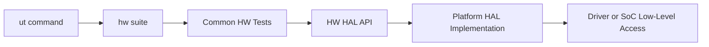
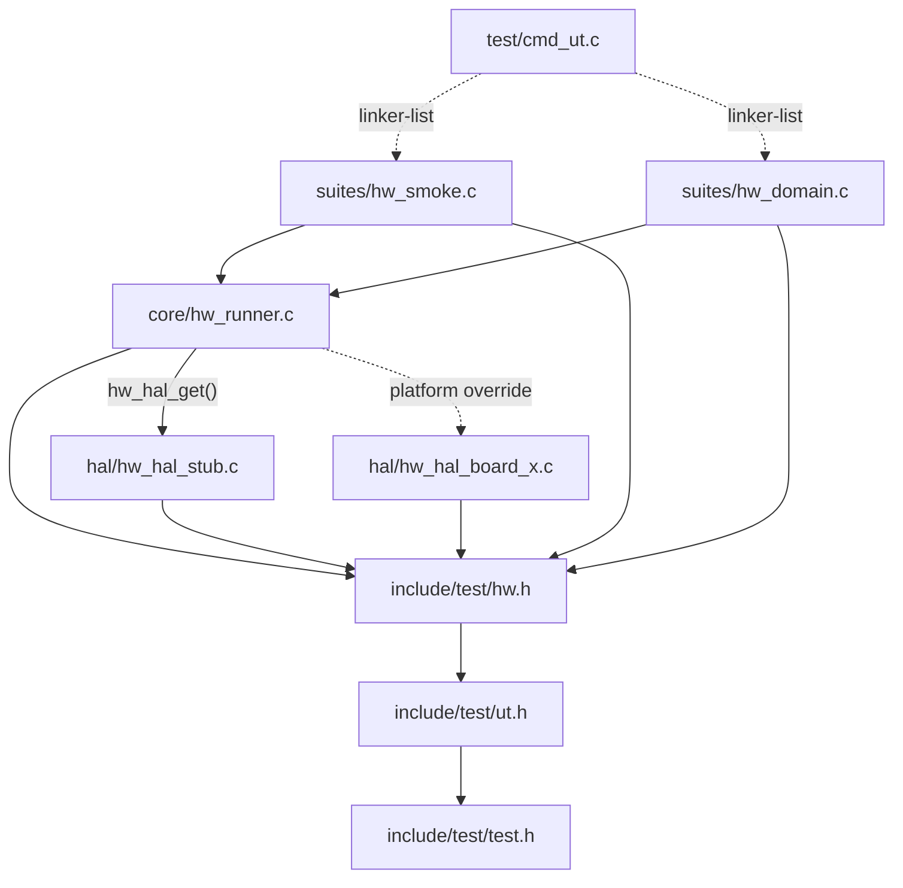
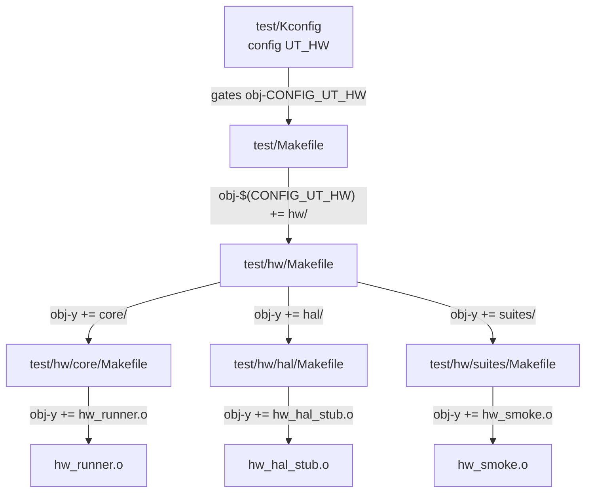
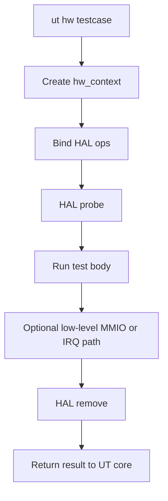

# U-Boot HW Test Design (First Principles)

### Why this is the right level of design

- maximizes reuse of the existing `ut` infrastructure,
- keeps HW-specific code isolated under `test/hw/`,
- uses a thin HAL layer to absorb platform differences,
- still allows low-level access such as MMIO, IRQ, clock, and reset when needed,
- avoids introducing framework overhead beyond the actual scope of the problem.

### What this design gives the team

- a consistent entry point: `ut hw <testcase>`,
- a clear boundary between test logic and platform implementation,
- a model that expands naturally by domain such as GPIO, I2C, SPI, reset, and clock,
- an architecture that stays small enough to maintain while still reaching hardware-level behavior.

### What this design does not try to do

- it does not replace `ut`,
- it does not introduce a new command or test engine,
- it does not build a general-purpose capability framework,
- it is not optimized for every kind of test outside hardware validation.

### Executive recommendation

Continue investing in the `ut hw + thin HAL` direction. Only expand the abstraction when real pain appears around multi-platform lifecycle, fixture orchestration, or observability at larger scale.

## 1) Role

`hw` is a sub-suite of `ut` with a dedicated role: hardware validation.

Its entry point is:

```text
ut hw <testcase>
```

The specialized code is grouped under:

```text
test/hw/
```

The architectural equation for this model is:

$$
HW\ Test = UT\ Core + HAL\ Boundary + HW\ Suites
$$

The role of each part is:

- `UT Core`: registration, assertions, reporting, suite dispatch, and basic lifecycle.
- `HAL Boundary`: isolates platform-specific low-level access from common test logic.
- `HW Suites`: express test intent for GPIO, I2C, SPI, reset, clock, MMIO, and IRQ.

---

## 2) Ability

| Ability | How it is achieved |
|---|---|
| Maximum UT reuse | uses `UNIT_TEST`, `unit_test_state`, `ut_assert`, and the `ut` dispatcher |
| HW code isolation | groups code under `test/hw/` |
| Portability | pushes platform differences down into HAL |
| Low-level access | allows MMIO, IRQ, clock, and reset through HAL operations |
| Low dependency | common test logic does not call sandbox or private internals directly |
| Domain-based extensibility | adds new test files under `test/hw/suites/` and new HAL implementations under `test/hw/hal/` |
| Better debug path | standardizes the boundary so dumps and observability stay consistent |

---

## 3) Overall Architecture



## 3.1 Functional decomposition

- `ut` remains the test engine.
- `hw suite` is the namespace for organizing test cases.
- `HW HAL API` is the single boundary between test logic and platform specifics.
- `Platform HAL Implementation` is where the design reaches drivers, registers, IRQ, clock, and reset.

## 3.2 Key principle

Common test cases should not talk directly to:

- `gd`,
- sandbox-only helpers,
- private driver state,
- board-specific symbols.

Common test cases should only talk to HAL.

## 3.3 Module Dependency Graph

Arrow direction means "depends on / includes". Dashed arrows indicate build-time or runtime selection.



Key observations:

- `include/test/hw.h` is the central hub: every module inside `test/hw/` depends on it.
- `hw_runner.c` binds `unit_test_state` to the HAL and selects which HAL to use via `hw_hal_get()`.
- HAL implementations (`stub` or `platform`) are selected at build time, not runtime, so there is no dynamic dispatch overhead.
- `cmd_ut.c` reaches test cases through the linker-list mechanism, not via direct includes.

---

## 4) Proposed File Structure

```text
test/
  hw/
    Kconfig
    Makefile
    README.md
    core/
      hw_runner.c
    hal/
      hw_hal_stub.c
      hw_hal_sandbox.c
      hw_hal_board_x.c
    suites/
      hw_smoke.c
      hw_gpio.c
      hw_i2c.c
      hw_spi.c
      hw_reset.c
      hw_clock.c
include/
  test/
    hw.h
```

Boundary rule:

- most new code should stay under `test/hw/`,
- the minimal public contract should live in [u-boot/include/test/hw.h](u-boot/include/test/hw.h),
- outside that, only small integration hooks are needed in [u-boot/test/cmd_ut.c](u-boot/test/cmd_ut.c), [u-boot/test/Kconfig](u-boot/test/Kconfig), and [u-boot/test/Makefile](u-boot/test/Makefile).

## 4.1 Makefile Dependency Chain

The diagram below shows how the Kconfig gate controls the entire build and how each Makefile delegates down to its children.



Key points:

- `test/Kconfig` defines `CONFIG_UT_HW`; when disabled, the entire `test/hw/` tree is excluded from the build.
- `test/Makefile` is the only file in the root tree that needs a change; one line `obj-$(CONFIG_UT_HW) += hw/` is all it requires.
- `test/hw/Makefile` fans out to three subdirectories with no additional conditional logic.
- Adding a new HAL (e.g. `hw_hal_sandbox.o`) only requires updating `test/hw/hal/Makefile`.
- Adding a new suite (e.g. `hw_gpio.o`) only requires updating `test/hw/suites/Makefile`.
- No Makefile outside `test/Makefile` needs to change for root-level integration.

---

## 5) Minimal HAL Contract

HAL should stay small, explicit, and focused on the low-level access that HW tests actually need.

Minimal contract example:

```c
struct hw_hal_ops {
    int (*probe)(struct hw_context *ctx);
    void (*remove)(struct hw_context *ctx);
    int (*mmio_read32)(struct hw_context *ctx, phys_addr_t addr, u32 *val);
    int (*mmio_write32)(struct hw_context *ctx, phys_addr_t addr, u32 val);
};
```

It can later expand based on real demand:

```c
struct hw_hal_ops {
    int (*probe)(struct hw_context *ctx);
    void (*remove)(struct hw_context *ctx);
    int (*mmio_read32)(struct hw_context *ctx, phys_addr_t addr, u32 *val);
    int (*mmio_write32)(struct hw_context *ctx, phys_addr_t addr, u32 val);
    int (*irq_inject)(struct hw_context *ctx, uint irq);
    int (*clock_enable)(struct hw_context *ctx, const char *name);
    int (*clock_disable)(struct hw_context *ctx, const char *name);
    int (*reset_assert)(struct hw_context *ctx, const char *name);
    int (*reset_deassert)(struct hw_context *ctx, const char *name);
};
```

Rules:

- do not add APIs “just in case”,
- only expand HAL when an actual test case needs it.

---

## 6) Proposed Data Model

```c
struct hw_context {
    struct unit_test_state *uts;
    const struct hw_hal_ops *hal;
    void *platform_priv;
    ulong flags;
};
```

Meaning:

- `unit_test_state` remains the framework’s primary state object.
- `hw_context` is only a thin wrapper for HW tests.
- `platform_priv` allows HAL to carry platform-owned state without polluting common test logic.

---

## 7) Execution Workflow



This sequence keeps the lifecycle short and easier to debug than a multi-layer extension model.

---

## 8) Dependency Policy

## 8.1 Allowed

- [u-boot/include/test/test.h](u-boot/include/test/test.h)
- [u-boot/include/test/ut.h](u-boot/include/test/ut.h)
- [u-boot/include/test/hw.h](u-boot/include/test/hw.h)
- public subsystem APIs when a test is validating that subsystem’s behavior

## 8.2 Restricted

- private driver headers in common tests,
- sandbox helpers in common tests,
- direct access to `gd`, `dm_root`, or `gd->fdt_blob` from general HW test files,
- scattered hardcoded register addresses across many test cases.

## 8.3 Architectural rule

$$
Common\ HW\ Test \rightarrow HW\ HAL \rightarrow Platform\ Impl \rightarrow U\text{-}Boot\ Internals
$$

not:

$$
Common\ HW\ Test \rightarrow Random\ Internal\ Symbols
$$

---

## 9) Things That Are Easy to Miss

## 9.1 Capability-based skip

Not every platform has the same HW blocks. A standard skip mechanism is needed when:

- a clock or reset domain is missing,
- MMIO mapping is not available,
- there is no interrupt backend,
- the peripheral is not built in the current configuration.

## 9.2 Determinism

HW tests can become flaky unless these are controlled:

- delay,
- timeout,
- fixture ordering,
- side effects left behind by previous tests.

## 9.3 Observability

When a test fails, the debug data should be standardized:

- register dump,
- interrupt status,
- reset and clock state,
- driver probe state,
- relevant DT node or path.

## 9.4 Safety policy

Low-level writes can damage platform state. The design needs clear rules for:

- MMIO writes to sensitive regions,
- destructive reset sequences,
- clock disable operations that can freeze the device,
- memory overwrite outside the test-owned region.

## 9.5 Ownership

Ownership must be explicit:

- who owns the common HAL contract,
- who owns board or SoC HAL implementations,
- who reviews interface changes in `hw.h`.

---

## 10) Trade-off Table

| Aspect | Strength | Cost or Risk | Control needed |
|---|---|---|---|
| Simplicity | only one engine, `ut` | easy to erode if abstractions are added too early | keep HAL small and purpose-driven |
| Reuse | uses existing linker-list, assertions, reporting, and suite dispatch | depends on current `ut` lifecycle | do not fork runner logic |
| Portability | platform differences live behind HAL | HAL can grow too large if it absorbs too many use cases | only add APIs when a real test needs them |
| Low-level reach | reaches MMIO, IRQ, clock, and reset | can become an architectural bypass path | require common tests to go through HAL |
| Maintainability | clear boundary between test logic and platform code | ownership gaps can cause drift across board or SoC variants | assign clear owners for `hw.h` and each HAL implementation |
| Scalability | expands cleanly by test domain | not as strong as a more general framework if platform count grows rapidly | add abstraction only after real pain appears |
| Debugability | easy to add dumps at a shared boundary | multi-platform debug can still become flaky | standardize observability and cleanup |

### Design discipline needed

To preserve the benefits of this model, three rules matter most:

- do not add HAL APIs until a real test case requires them,
- do not let common tests access private internals directly,
- do not scatter hardcoded register addresses or resource names across multiple test files.

---

## 11) Coding Rules For HW Test Authors

### Rule set

- always start from `HW_TEST(...)` and `ut_assert...`; do not create a separate assertion framework,
- common test logic should only call APIs in [u-boot/include/test/hw.h](u-boot/include/test/hw.h) or approved public subsystem APIs,
- do not include private driver headers in common tests,
- do not read or write `gd`, `dm_root`, or `gd->fdt_blob` directly in test-domain files,
- do not hardcode register addresses in many places; if low-level access is needed, move mapping into HAL implementation or a centralized helper,
- each test case should validate one primary intent,
- always clean up every state change introduced by the test,
- every platform-dependent test should have an explicit skip policy,
- when testing low-level paths, always leave enough observability behind: expected value, actual state, and enough failure context to debug.

### Naming guidance

- suite command name: `hw`
- C testcase name: `hw_test_<domain>_<intent>`
- good examples:
  - `hw_test_gpio_direction_output`
  - `hw_test_i2c_eeprom_read`
  - `hw_test_clock_gate_sequence`

### Review checklist

- does the test really need a new HAL API,
- does the test bypass the architectural boundary,
- is cleanup symmetrical with setup,
- is failure output sufficient for debugging,
- is the test deterministic across repeated runs.

---

## 12) Minimal Implementation Roadmap

| Phase | Goal | Result |
|---|---|---|
| P1 | create `ut hw` skeleton | `hw_test_smoke` runs through `ut` |
| P2 | add stub HAL and one sandbox HAL | proves that the HAL boundary works |
| P3 | add one or two real HW suites | for example GPIO or I2C |
| P4 | add MMIO, IRQ, clock, and reset accessors as needed | increases low-level coverage |
| P5 | add skip policy and standard debug dump | improves stability across platforms |

---

## 13) Architectural Conclusion

The architecture should be finalized as follows:

- use the existing `ut` as the only test engine,
- create a new `hw` suite,
- isolate code under `test/hw/`,
- use a thin HAL as the only boundary for platform differences,
- only expand abstraction when real pain appears.

One sentence to align the team:

> HW test in U-Boot should be a sub-suite of `ut`, named `hw`, reusing all UT registration, assertion, and reporting mechanisms, while adding only a thin HAL to isolate platform-specific low-level access from common test logic.