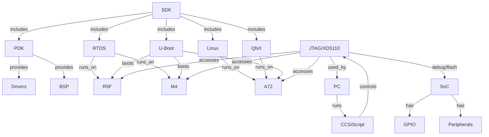

# Knowledge Graph: TI Processor SDK RTOS J784S4

## 1. Triết lý & Gốc rễ
- SDK hợp nhất phát triển đa lõi (A72, R5F, M4, DSP) cho các ứng dụng nhúng thời gian thực, AI, automotive, robotics.
- Cung cấp nền tảng phần mềm, driver, công cụ debug, tài liệu cho phát triển ứng dụng trên SoC Jacinto J784S4.

## 2. Kiến trúc hệ thống (Mermaid)



## 3. Các thành phần chính
| Thành phần      | Vai trò chính | Chạy trên core | Liên quan RTOS |
|----------------|--------------|----------------|----------------|
| SDK            | Tổng hợp      | Tất cả         | Bắt buộc       |
| PDK            | Driver/HAL    | Tất cả         | Bắt buộc       |
| RTOS           | OS thời gian thực | R5F/M4     | Chính          |
| U-Boot         | Bootloader    | Tất cả         | Bắt buộc       |
| Linux/QNX      | HLOS          | A72            | Không          |
| JTAG/XDS110    | Debug/Flash   | Tất cả         | Hỗ trợ         |
| CCS/Script     | Điều khiển debug | PC         | Hỗ trợ         |

## 4. Quy trình phát triển RTOS & Real Core Access
1. Build ứng dụng (ví dụ: blink LED) từ PDK/RTOS cho R5F/M4
2. Kết nối board qua XDS110
3. Sử dụng CCS Script Console (JavaScript) hoặc UniFlash để nạp/debug
4. Ứng dụng chạy trên real-time core, có thể truy cập GPIO, peripheral trực tiếp
5. Debug, trace, log qua JTAG/XDS110

## 6. Truy cập trực tiếp thanh ghi GPIO qua XDS110 script console

- Nếu CPU (R5) ở chế độ "no boot" (không chạy firmware, dừng ở reset vector), bạn có thể đọc/ghi trực tiếp vào vùng nhớ register của GPIO qua XDS110 script console mà không cần nạp file .bin/.out nào.
- Điều kiện:
    - Core không bị reset hoặc chiếm quyền bởi firmware khác.
    - Firewall/security (DMSC) đã mở quyền peripheral cho R5 (thường mặc định trên EVM chuẩn, hoặc cần cấp quyền qua Sciclient nếu custom).
- Nếu firewall chưa mở, truy cập sẽ bị lỗi. Khi đó cần chạy SBL hoặc dùng Sciclient để cấp quyền peripheral.
- Khi đã đủ điều kiện, có thể dùng script như sau:
    ```javascript
    var baseAddr = 0x00600000; // ví dụ base address GPIO0
    var data = session.memory.readWord(0, baseAddr + offset);
    session.memory.writeWord(0, baseAddr + offset, value);
    ```
- Chế độ "no boot" là lý tưởng để thao tác thanh ghi trực tiếp, không bị firmware chiếm quyền.

## 5. Tài liệu tham khảo
- docs/userguide/j784s4/modules/gpio.html
- docs/userguide/j784s4/board/board_support.html
- docs/userguide/j784s4/howto/

---
**Knowledge graph này giúp bạn hình dung tổng thể các thành phần, luồng dữ liệu, và workflow để bắt đầu phát triển ứng dụng RTOS trên J784S4.**
