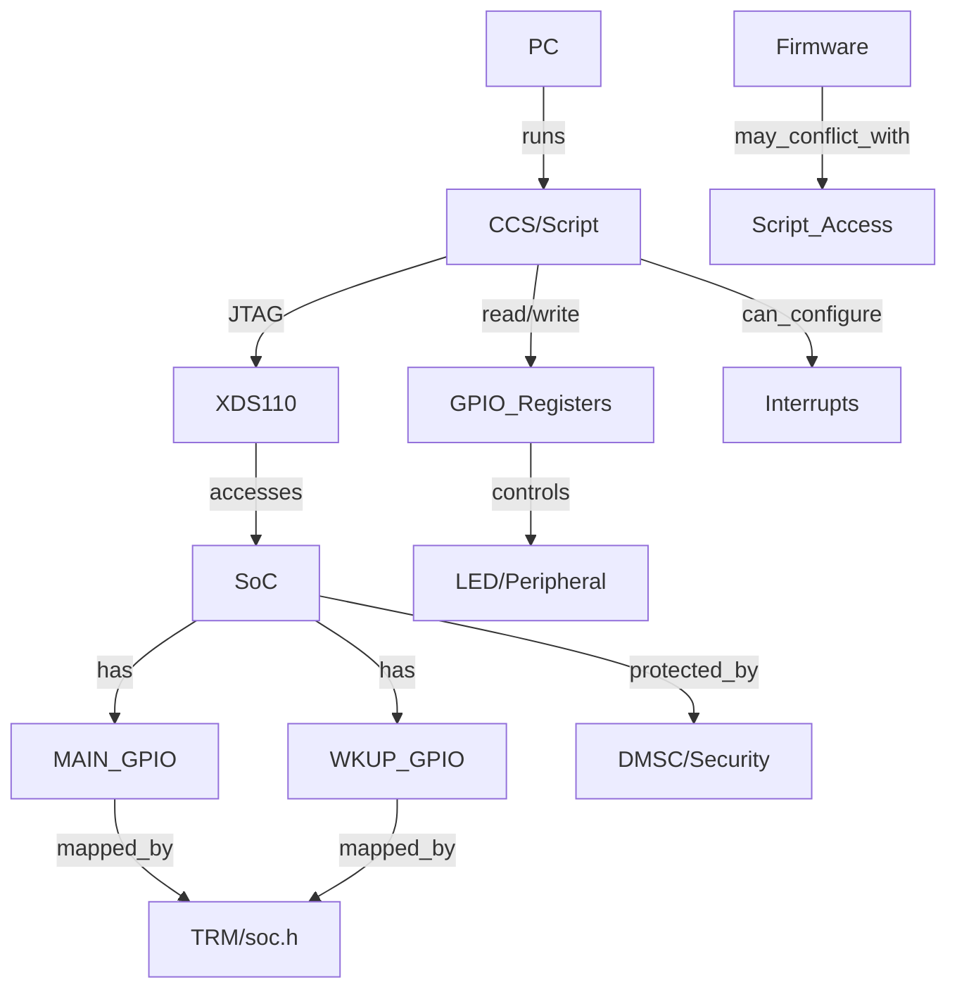

# Knowledge Graph: GPIO & Script Console trên J784S4

## Thành phần chính & mối liên hệ
- **CCS Script Console:** Công cụ điều khiển, truy cập thanh ghi, automate test.
- **JTAG/XDS110:** Cầu nối vật lý giữa PC và SoC.
- **GPIO Registers:** Địa chỉ xác định qua TRM, thao tác trực tiếp hoặc qua driver.
- **Firmware/RTOS:** Có thể gây race nếu cùng truy cập GPIO.
- **Security/Firewall:** Có thể cần mở quyền peripheral trước khi truy cập.

## Best Practice cho Senior
- Luôn kiểm tra trạng thái core trước khi thao tác thanh ghi.
- Sử dụng script để automate test, log, hoặc stress test GPIO.
- Nếu cần kiểm thử interrupt, phải cấu hình đầy đủ vector và mask.
- Đảm bảo không xung đột với firmware đang chạy (dùng mutex hoặc thao tác khi core idle).
- Ghi chú lại mapping địa chỉ, version TRM, và script mẫu để tái sử dụng.
