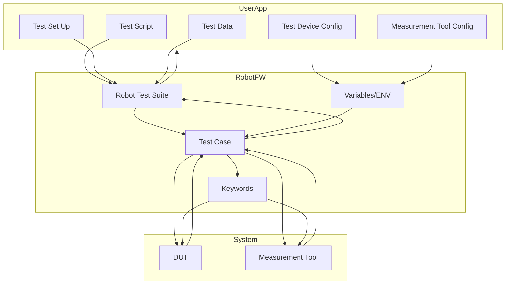
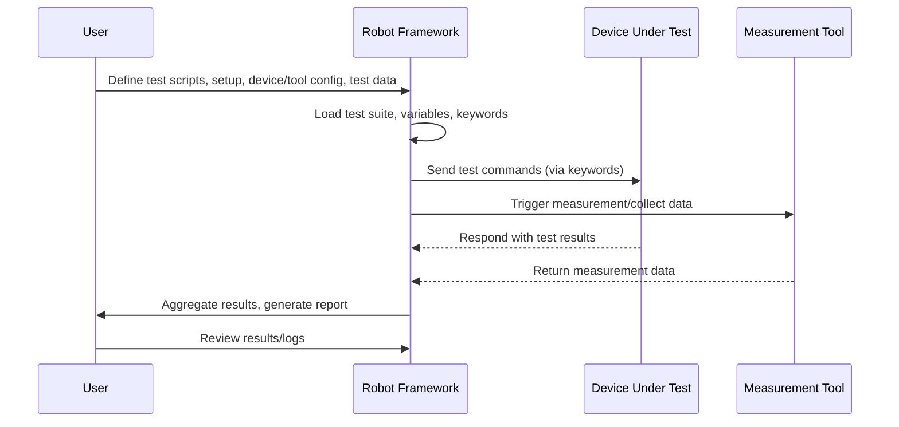

# Robot Framework Application & Test Handling Architecture

This document describes a high-level workflow and architecture for a Robot Framework-based test system, including test script, setup, device, DUT, and measurement tool integration.

## Architecture Diagram

## Workflow Description

1. **User Application Layer**
    - Defines test scripts, setup, device and measurement tool configuration, and test data.
2. **Robot Framework Layer**
    - Robot test suite orchestrates test cases, keywords, and variable/config management.
    - Test cases interact with DUT and measurement tools using keywords and variables.
3. **System Under Test**
    - DUT and measurement tools are controlled and measured.
    - Results and logs are collected and reported.

---

This architecture supports flexible test setup, device/config mapping, and measurement integration for robust automated testing.
