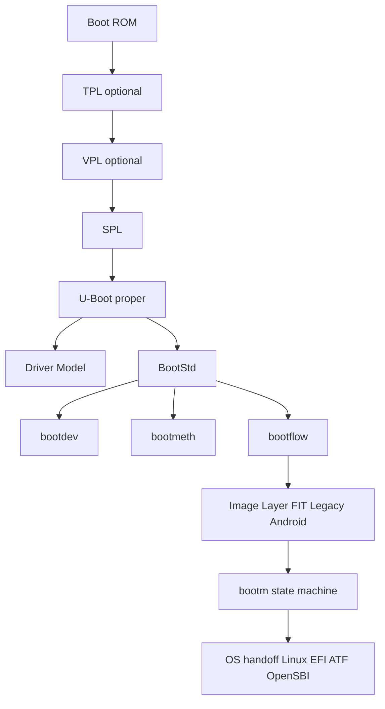
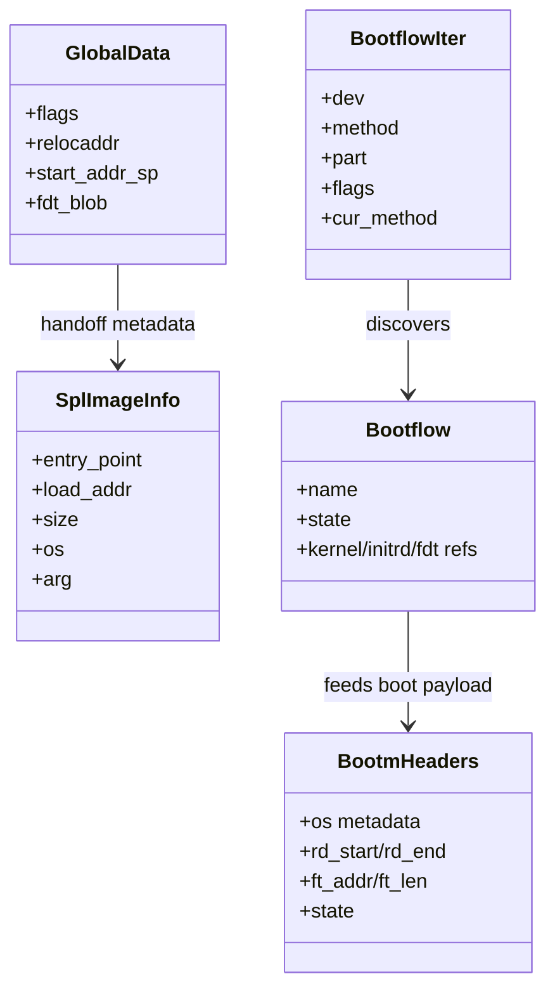
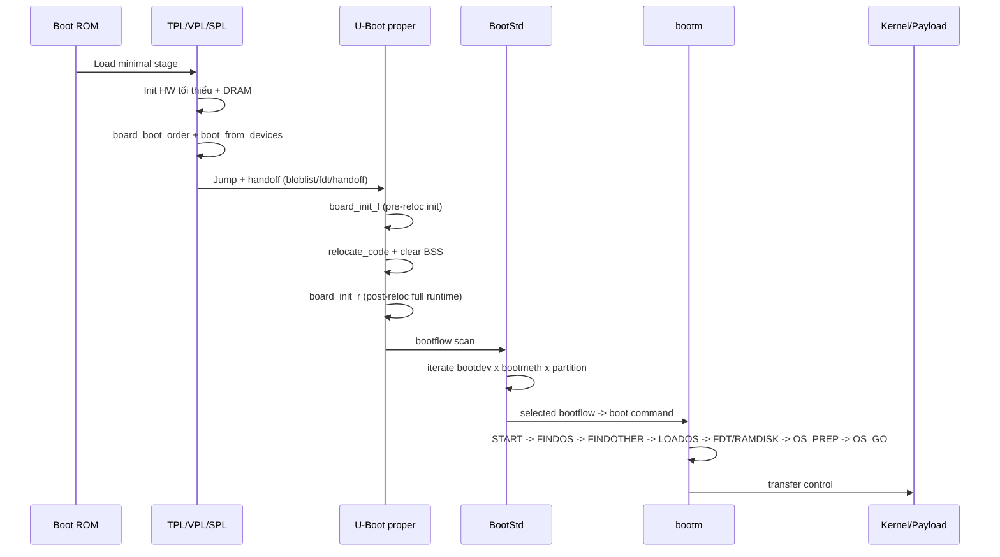

# U-Boot First Principles Know-How

## 1. Philosophy & Fundamentals

U-Boot tồn tại để lấp khoảng trống giữa Boot ROM tối giản và hệ điều hành đầy đủ:

- Boot ROM có năng lực hạn chế (RAM nhỏ, I/O tối thiểu, logic cứng).
- OS yêu cầu môi trường đã sẵn sàng (DRAM, clock, console, DTB, bootargs, image hợp lệ).
- U-Boot cung cấp chuỗi chuyển trạng thái có kiểm soát: từ phần cứng thô sang môi trường thực thi chuẩn hóa cho OS.

### Bài toán cốt lõi

1. Khởi tạo phần cứng theo từng mức tài nguyên.
2. Tìm và nạp ảnh boot từ nhiều nguồn (MMC/NVMe/NAND/USB/NET...).
3. Xác thực tính toàn vẹn/tính xác thực (FIT/signature/measured boot).
4. Handoff nhất quán sang payload tiếp theo (ATF/OpenSBI/U-Boot proper/Linux/EFI payload).

### Nguyên lý nền tảng

- Ràng buộc bộ nhớ pha sớm:

$$
S_{stage} \le M_{onchip}
$$

- Tổng thời gian boot:

$$
T_{boot}=T_{init}+T_{discover}+T_{load}+T_{verify}+T_{handoff}
$$

- Chuỗi tin cậy: mỗi pha chỉ chuyển quyền thực thi khi điều kiện hợp lệ được thỏa.

---

## 2. System Architecture

## 2.1 Main Domains

| Domain | Vai trò | Thành phần tiêu biểu |
|---|---|---|
| Early Runtime | Dựng môi trường C tối thiểu, lập kế hoạch relocation | crt0, board_init_f, gd |
| xPL Chain | TPL/VPL/SPL để vượt ràng buộc bộ nhớ sớm | spl.c, spl loaders |
| U-Boot Proper Runtime | Driver model đầy đủ, env, CLI, network, storage | board_init_r, DM |
| Boot Discovery | Quét nguồn boot chuẩn hóa | bootdev, bootmeth, bootflow |
| Image + Handoff | Parse/verify/load image và nhảy vào OS | bootm, bootm_os |

## 2.2 Architecture Diagram



## 2.3 Entity Relationships (Conceptual)



---

## 3. Workflow & Data Lifecycle

## 3.1 End-to-End Execution Flow



## 3.2 BootStd Discovery Algorithm

```text
while (next bootdev)
  while (next bootmeth)
    while (next bootflow)
      try boot
```

Đây là lazy traversal: chỉ mở rộng phạm vi quét khi cần, giảm độ trễ startup.

## 3.3 Data Movement theo pha

1. crt0 tạo stack/GD sơ khai.
2. board_init_f ghi kế hoạch relocation vào GD (địa chỉ RAM đích, stack mới, vùng reserve).
3. relocate_code chuyển binary sang RAM.
4. board_init_r tái khởi tạo runtime đầy đủ và DM.
5. BootStd tạo bootflow từ media + method + config file.
6. bootm parse image, chuẩn bị kernel/initrd/fdt, gọi OS-specific boot function.

---

## 4. Technical Deep-Dive (Essential)

## 4.1 SPL decision core

- board_boot_order() xác định thứ tự boot devices.
- boot_from_devices() duyệt qua các loader theo device.
- spl_parse_image_header() nhận dạng FIT/legacy/raw.
- jumper được chọn theo OS mục tiêu: U-Boot, ATF, OP-TEE, OpenSBI, Linux.

## 4.2 bootm state machine

- START
- PRE_LOAD (optional check)
- FINDOS
- FINDOTHER (initrd/fdt)
- MEASURE (nếu measured boot bật)
- LOADOS
- RAMDISK/FDT relocation
- OS_PREP
- OS_GO

Mỗi state có điều kiện lỗi/thoát sớm rõ ràng, tạo tính quyết định (deterministic behavior).

## 4.3 Performance/Resource constraints

Với số thiết bị boot là \(D\), số boot method là \(M\), số partition là \(P\):

$$
C_{scan}\approx O(D\times M\times P)
$$

Thực tế được giảm bằng ordering và policy (boot_targets, bootmeth order, priority).

---

## 5. Kết luận First Principles

U-Boot là một hệ chuyển trạng thái đa pha, tối ưu cho:

- Giới hạn tài nguyên ban đầu.
- Khả năng mở rộng đa kiến trúc/đa board.
- Tính xác định trong tìm-nạp-xác thực-handoff.

Nếu rút gọn về bản chất:

- Input: phần cứng chưa chuẩn hóa + media boot không chắc chắn.
- Process: init theo pha + discovery + verification + relocation.
- Output: môi trường thực thi chuẩn hóa và an toàn cho payload kế tiếp.
