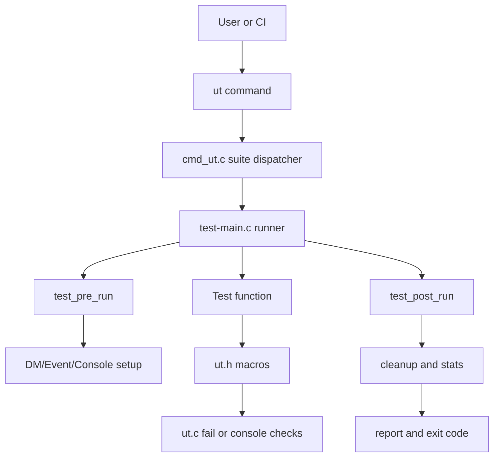
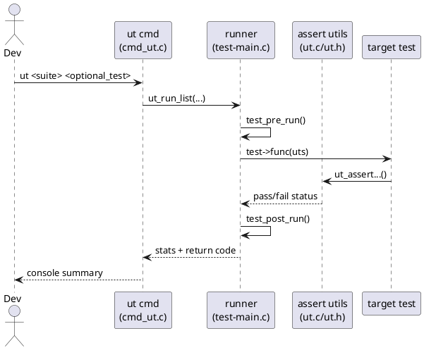
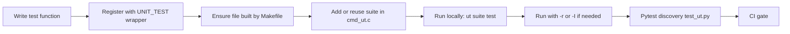
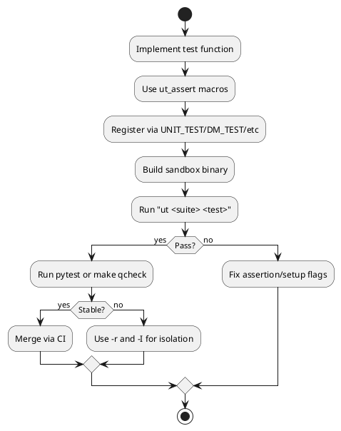

# U-Boot UT Know-How (First Principles)

## Ghi chú phạm vi

Bạn yêu cầu `./u-boot/tests/ut.c`, nhưng trong repo hiện tại file lõi là [u-boot/test/ut.c](u-boot/test/ut.c).

---

## 1) Philosophy and Fundamentals

### Mục đích tồn tại của module UT

`ut.c` không phải là test runner đầy đủ. Nó là **assertion/runtime utility layer** cho hệ thống unit test C của U-Boot:

- Ghi nhận failure theo định dạng nhất quán.
- Kiểm soát console capture/decode để so sánh output command.
- Hỗ trợ memory leak checks (`ut_check_free`, `ut_check_delta`).
- Điều khiển im/lặng output để test có tính quyết định.

### Bài toán cốt lõi mà nó giải quyết

Nếu không có lớp này, mỗi test file sẽ:

- Tự viết logic assert.
- Tự parse output console.
- Tự thu thập và report fail counter.

Kết quả là không đồng nhất và khó tự động hóa. `ut.c` cung cấp một "toán tử chung" cho phép test function chỉ tập trung vào intent kiểm thử.

### Nguyên lý nền tảng

1. **Determinism**: test phải có output nhất quán.
2. **Isolation**: test state được reset pre/post.
3. **Minimal overhead**: assert macro + linker-list registration.
4. **Machine-consumable**: pytest có thể phát hiện/rerun test tương ứng.

---

## 2) Kiến trúc hệ thống test C trong U-Boot

## 2.1 Main components

| Thành phần | Vai trò | File chính |
|---|---|---|
| Assertion utilities | fail/report/console checks/memory delta | [u-boot/test/ut.c](u-boot/test/ut.c), [u-boot/include/test/ut.h](u-boot/include/test/ut.h) |
| Test metadata model | `unit_test`, `unit_test_state`, flags | [u-boot/include/test/test.h](u-boot/include/test/test.h) |
| Runner core | pre-run/post-run, DM reset, run list | [u-boot/test/test-main.c](u-boot/test/test-main.c) |
| Command bridge | lệnh `ut` + suite dispatch | [u-boot/test/cmd_ut.c](u-boot/test/cmd_ut.c) |
| Build wiring | test object linking theo phase | [u-boot/test/Makefile](u-boot/test/Makefile) |
| Pytest automation | auto-discover và gọi `ut` | [u-boot/test/py/tests/test_ut.py](u-boot/test/py/tests/test_ut.py) |

## 2.2 Kiến trúc luồng gọi



## 2.3 PlantUML sequence



---

## 3) Workflow thuc thi du lieu

## 3.1 Data objects

- `struct unit_test`: metadata của 1 test (name, func, flags).
- `struct unit_test_state`: state runtime xuyên suốt (stats, DT mode, buffers, etc.).
- `struct ut_stats`: counters fail/skip/test/duration.

## 3.2 Lifecycle

1. `ut` command nhận suite và filter.
2. Suite map ra linker-list (`UNIT_TEST`, `UNIT_TEST_INIT`, `UNIT_TEST_UNINIT`).
3. `ut_run_list()` chuẩn bị state và detect DM requirements.
4. Mỗi test:
   - `test_pre_run()` setup event/DM/console record/FDT mode.
  - gọi test function.
  - assertion bắt lỗi qua `ut_fail`/`ut_failf`.
   - `test_post_run()` cleanup.
5. Tổng hợp report + mã thoát.

### Công thức tổng quát

Nếu có `N` tests và mỗi test chạy `r` lần:

$$
T_{total} \approx \sum_{i=1}^{N}\left(T_{setup,i} + r\cdot T_{body,i} + T_{cleanup,i}\right)
$$

`UTF_DM` làm tăng chi phí setup nhưng đổi lại tính isolated cao hơn.

---

## 4) Module này tương tác với U-Boot như thế nào

## 4.1 Tương tác với console subsystem

- `ut_check_console_line()` đọc output từ `console_record_readline()`.
- Cần `UTF_CONSOLE` + `console_record_reset_enable()` trong pre-run.
- Dùng để test command behavior một cách machine-checkable.

## 4.2 Tương tác với Driver Model (DM)

- `UTF_DM` kích hoạt `dm_test_pre_run()` / `dm_test_post_run()`.
- Mỗi test DM được reset model state để tránh side effect.
- Hỗ trợ run trên live tree và flat tree.

## 4.3 Tương tác với global runtime

- Tác động `gd->flags` để unsilence output khi fail.
- Cho phép quản lý bloblist, event framework, cyclic jobs, blkcache.
- Đảm bảo test không phá vỡ trạng thái runtime cho test kế tiếp.

## 4.4 Tương tác với build/link system

- Macro `UNIT_TEST()` tạo linker-list entry.
- `cmd_ut.c` SUITE_DECL/SUITE map suite name sang đoạn linker-list.
- `test/Makefile` quyết định object nào được build theo Kconfig/phase.

## 4.5 Cac suite UT hien co va testcase dai dien

Ở snapshot source hiện tại, `ut` command chuẩn khai báo 26 top-level suites trong [u-boot/test/cmd_ut.c](u-boot/test/cmd_ut.c). Tuy nhiên, việc suite có chạy được trong build cụ thể hay không vẫn phụ thuộc Kconfig, vì một suite có thể đã được khai báo nhưng linker-list của nó rỗng.

Bảng dưới đây không nhằm liệt kê toàn bộ mọi test. Mục tiêu là chỉ ra các testcase thực sự đang tồn tại trong tree để bạn có thể:

- định vị nhanh nơi cần mở rộng coverage,
- tìm mẫu test tương tự để copy/biến đổi,
- hiểu suite nào đang kiểm thử subsystem nào.

| Suite | Trọng tâm kiểm thử | Testcase hiện có tiêu biểu | File chính |
|---|---|---|---|
| addrmap | hành vi command `addrmap` | `addrmap_test_basic` | [u-boot/test/cmd/addrmap.c](u-boot/test/cmd/addrmap.c) |
| bdinfo | validate output board info | `bdinfo_test_full`, `bdinfo_test_help`, `bdinfo_test_memory` | [u-boot/test/cmd/bdinfo.c](u-boot/test/cmd/bdinfo.c) |
| bloblist | bloblist core logic và command path | `bloblist_test_init`, `bloblist_test_checksum`, `bloblist_test_cmd_list` | [u-boot/test/common/bloblist.c](u-boot/test/common/bloblist.c) |
| bootm | thay tham số và silent behavior của `bootm` | `bootm_test_nop`, `bootm_test_silent`, `bootm_test_subst_both` | [u-boot/test/boot/bootm.c](u-boot/test/boot/bootm.c) |
| bootstd | standard boot, bootflow, bootdev, bootmeth, expo, cedit, VBE | `bootflow_cmd`, `bootdev_test_cmd_list`, `bootmeth_cmd_list`, `expo_base`, `cedit_base`, `vbe_simple_test_base` | [u-boot/test/boot/bootflow.c](u-boot/test/boot/bootflow.c), [u-boot/test/boot/bootdev.c](u-boot/test/boot/bootdev.c), [u-boot/test/boot/bootmeth.c](u-boot/test/boot/bootmeth.c), [u-boot/test/boot/expo.c](u-boot/test/boot/expo.c), [u-boot/test/boot/cedit.c](u-boot/test/boot/cedit.c), [u-boot/test/boot/vbe_simple.c](u-boot/test/boot/vbe_simple.c) |
| cmd | command tests không thuộc suite chuyên biệt khác | `command_test`, `cmd_test_qfw_list`, `cmd_test_cpuid`, `net_test_wget` | [u-boot/test/cmd/command.c](u-boot/test/cmd/command.c), [u-boot/test/cmd/qfw.c](u-boot/test/cmd/qfw.c), [u-boot/test/cmd/cpuid.c](u-boot/test/cmd/cpuid.c), [u-boot/test/cmd/wget.c](u-boot/test/cmd/wget.c) |
| common | helper trong `common/`, CLI input, print, event, autoboot | `test_event_base`, `cread_test`, `print_printf`, `test_autoboot` | [u-boot/test/common/event.c](u-boot/test/common/event.c), [u-boot/test/common/cread.c](u-boot/test/common/cread.c), [u-boot/test/common/print.c](u-boot/test/common/print.c), [u-boot/test/common/test_autoboot.c](u-boot/test/common/test_autoboot.c) |
| dm | Driver Model subsystems và command integration | `dm_test_rtc_set_get`, `dm_test_mmc_base`, `dm_test_iommu`, `dm_test_dma`, `dm_test_virtio_rng_check_len` | [u-boot/test/dm/rtc.c](u-boot/test/dm/rtc.c), [u-boot/test/dm/mmc.c](u-boot/test/dm/mmc.c), [u-boot/test/dm/iommu.c](u-boot/test/dm/iommu.c), [u-boot/test/dm/dma.c](u-boot/test/dm/dma.c), [u-boot/test/dm/virtio_rng.c](u-boot/test/dm/virtio_rng.c) |
| env | environment, attributes, hash table, FDT import | `env_test_env_cmd`, `env_test_attrs_lookup`, `env_test_htab_fill`, `env_test_fdt_import` | [u-boot/test/env/cmd_ut_env.c](u-boot/test/env/cmd_ut_env.c), [u-boot/test/env/attr.c](u-boot/test/env/attr.c), [u-boot/test/env/hashtable.c](u-boot/test/env/hashtable.c), [u-boot/test/env/fdt.c](u-boot/test/env/fdt.c) |
| exit | semantics của `exit` trong shell và propagation return code | `cmd_exit_test` | [u-boot/test/cmd/exit.c](u-boot/test/cmd/exit.c) |
| fdt | hành vi `fdt` command: addressing, query, mutate, apply | `fdt_test_addr`, `fdt_test_get_value`, `fdt_test_set`, `fdt_test_apply` | [u-boot/test/cmd/fdt.c](u-boot/test/cmd/fdt.c) |
| fdt_overlay | merge overlay và xử lý phandle | `fdt_overlay_test_change_int_property`, `fdt_overlay_test_add_node_by_path`, `fdt_overlay_test_stacked` | [u-boot/test/fdt_overlay/cmd_ut_fdt_overlay.c](u-boot/test/fdt_overlay/cmd_ut_fdt_overlay.c) |
| font | `font` command và render path | `font_test_base` | [u-boot/test/cmd/font.c](u-boot/test/cmd/font.c) |
| hw | kiểm thử hardware thông qua một lớp HAL mỏng | `hw_test_smoke` | [u-boot/test/hw/suites/hw_smoke.c](u-boot/test/hw/suites/hw_smoke.c), [u-boot/include/test/hw.h](u-boot/include/test/hw.h) |
| hush | semantics của ngôn ngữ shell hush | `hush_test_if_base`, `hush_test_simple_dollar`, `hush_test_for`, `hush_test_and_or` | [u-boot/test/hush/if.c](u-boot/test/hush/if.c), [u-boot/test/hush/dollar.c](u-boot/test/hush/dollar.c), [u-boot/test/hush/loop.c](u-boot/test/hush/loop.c), [u-boot/test/hush/list.c](u-boot/test/hush/list.c) |
| lib | code thư viện mức thấp: crypto, Unicode, string/memory, compression | `lib_test_lmb_simple`, `lib_rsa_verify_valid`, `unicode_test_utf8_get`, `compression_test_gzip`, `lib_test_sha256_hmac` | [u-boot/test/lib/lmb.c](u-boot/test/lib/lmb.c), [u-boot/test/lib/rsa.c](u-boot/test/lib/rsa.c), [u-boot/test/lib/unicode.c](u-boot/test/lib/unicode.c), [u-boot/test/lib/compression.c](u-boot/test/lib/compression.c), [u-boot/test/lib/test_sha256_hmac.c](u-boot/test/lib/test_sha256_hmac.c) |
| loadm | parse tham số và load memory blob của `loadm` | `loadm_test_params`, `loadm_test_load` | [u-boot/test/cmd/loadm.c](u-boot/test/cmd/loadm.c) |
| log | log formatting, no-log path, syslog, continuation semantics | `log_test_cont`, `log_test_nolog_err`, `log_test_syslog_err`, `log_test_pr_cont` | [u-boot/test/log/cont_test.c](u-boot/test/log/cont_test.c), [u-boot/test/log/nolog_test.c](u-boot/test/log/nolog_test.c), [u-boot/test/log/syslog_test.c](u-boot/test/log/syslog_test.c), [u-boot/test/log/pr_cont_test.c](u-boot/test/log/pr_cont_test.c) |
| mbr | execution path của `mbr` command | `mbr_test_run` | [u-boot/test/cmd/mbr.c](u-boot/test/cmd/mbr.c) |
| measurement | measured boot dựa trên TPM | `measure` | [u-boot/test/boot/measurement.c](u-boot/test/boot/measurement.c) |
| mem | command copy/search memory | `mem_test_cp_b`, `mem_test_cp_q`, `mem_test_ms_b`, `mem_test_ms_quiet` | [u-boot/test/cmd/mem_copy.c](u-boot/test/cmd/mem_copy.c), [u-boot/test/cmd/mem_search.c](u-boot/test/cmd/mem_search.c) |
| optee | helper fix-up device tree cho OP-TEE | `optee_fdt_copy_empty`, `optee_fdt_copy_prefilled`, `optee_fdt_copy_already_filled` | [u-boot/test/optee/optee.c](u-boot/test/optee/optee.c) |
| pci_mps | an toàn cấu hình PCIe Maximum Payload Size | `test_pci_mps_safe` | [u-boot/test/cmd/pci_mps.c](u-boot/test/cmd/pci_mps.c) |
| seama | decode path của command SEAMA | `seama_test_noargs`, `seama_test_addr`, `seama_test_index` | [u-boot/test/cmd/seama.c](u-boot/test/cmd/seama.c) |
| setexpr | integer, regex, string và format-expression | `setexpr_test_int`, `setexpr_test_regex`, `setexpr_test_str_oper`, `setexpr_test_fmt` | [u-boot/test/cmd/setexpr.c](u-boot/test/cmd/setexpr.c) |
| upl | Universal Payload data model và read/write path | `upl_test_base`, `upl_test_info`, `upl_test_read_write`, `upl_test_info_norun` | [u-boot/test/boot/upl.c](u-boot/test/boot/upl.c) |

Ví dụ lệnh chạy trực tiếp lên testcase đang tồn tại:

```bash
./u-boot -T -c "ut bootm bootm_test_subst_both"
./u-boot -T -c "ut dm dm_test_rtc_set_get"
./u-boot -T -c "ut fdt fdt_test_apply"
./u-boot -T -c "ut hw hw_test_smoke"
./u-boot -T -c "ut hush hush_test_for"
```

## 4.6 Cac UT cases hien co chi danh cho SPL/XPL

Không phải toàn bộ UT coverage đều đi qua `ut` top-level command chuẩn. Khi build SPL/XPL với config tương ứng, thư mục [u-boot/test/image/](u-boot/test/image/) bổ sung một họ testcase riêng cho image-loading.

Các nhóm SPL-oriented test tiêu biểu đang có:

| Nhóm | Phạm vi kiểm thử | Registration tiêu biểu | File nguồn |
|---|---|---|---|
| core image parsing | parse/load image header trong SPL | `spl_test_image` với `LEGACY`, `IMX8`, `FIT_INTERNAL`, `FIT_EXTERNAL` | [u-boot/test/image/spl_load.c](u-boot/test/image/spl_load.c) |
| filesystem loaders | load image qua ext/fat và block device | `spl_test_ext`, `spl_test_fat`, `spl_test_blk`, `spl_test_mmc` | [u-boot/test/image/spl_load_fs.c](u-boot/test/image/spl_load_fs.c) |
| flash/network media | load path qua NOR, NAND, SPI, network | `spl_test_nor`, `spl_test_nand`, `spl_test_spi`, `spl_test_net` | [u-boot/test/image/spl_load_nor.c](u-boot/test/image/spl_load_nor.c), [u-boot/test/image/spl_load_nand.c](u-boot/test/image/spl_load_nand.c), [u-boot/test/image/spl_load_spi.c](u-boot/test/image/spl_load_spi.c), [u-boot/test/image/spl_load_net.c](u-boot/test/image/spl_load_net.c) |
| OS handoff | đường đi load OS từ SPL | `spl_test_load` | [u-boot/test/image/spl_load_os.c](u-boot/test/image/spl_load_os.c) |

Ý nghĩa của nhóm này là: cùng một mô hình assertion + linker-list, nhưng được kiểm thử trong build phase khác, nơi init order, command availability, và media path khác với sandbox `ut` thông thường.

---

## 5) Cách tạo test mới (thực hành)

## 5.1 Add test vào suite có sẵn

1. Tìm file suite, ví dụ [u-boot/test/boot/bootm.c](u-boot/test/boot/bootm.c).
2. Viết function:

```c
static int bootm_test_new_case(struct unit_test_state *uts)
{
    ut_assertok(run_command("echo hello", 0));
    return 0;
}
BOOTM_TEST(bootm_test_new_case, UTF_CONSOLE);
```

3. Đảm bảo file đó đang được build trong Makefile.

## 5.2 Tạo suite mới

1. Tạo file test mới, define macro suite wrapper:

```c
#define WIBBLE_TEST(_name, _flags) UNIT_TEST(_name, _flags, wibble_test)
```

2. Thêm tests bằng `WIBBLE_TEST(...)`.
3. Đăng ký suite trong [u-boot/test/cmd_ut.c](u-boot/test/cmd_ut.c):
   - `SUITE_DECL(wibble);`
   - `SUITE(wibble, "...description...")`
4. Thêm object vào Makefile phù hợp.

## 5.3 Chọn flags đúng

- `UTF_CONSOLE`: cần capture output command.
- `UTF_DM`: test liên quan driver model.
- `UTF_SCAN_FDT`: cần bind devices từ DT.
- `UTF_MANUAL`: test chỉ chạy khi `ut -f`; tên test phải kết thúc `_norun`.

---

## 6) Automation với UT

## 6.1 Local fast loop

- Chạy all suites:

```bash
./u-boot -T -c "ut all"
```

- Chạy một suite:

```bash
./u-boot -T -c "ut dm"
```

- Chạy một test:

```bash
./u-boot -T -c "ut dm dm_test_gpio"
```

- Stress race (`-r`):

```bash
./u-boot -T -c "ut dm -r100 dm_test_rtc_set_get"
```

- Isolate cross-test pollution (`-I`):

```bash
./u-boot -T -c "ut dm -I82:dm_test_host"
```

## 6.2 Pytest integration

- Unit tests C được pytest thu thập và gọi thông qua [u-boot/test/py/tests/test_ut.py](u-boot/test/py/tests/test_ut.py).
- Command tổng:

```bash
make check
```

- Quick subset:

```bash
make qcheck
```

## 6.3 CI strategy đề xuất

1. Stage 1: `ut info` sanity + selected critical suites (`dm,bootstd,bootm`).
2. Stage 2: `ut all` tren sandbox test DT (`-T`).
3. Stage 3: pytest (`make qcheck` mỗi commit, `make check` theo lịch/nightly).
4. Stage 4: flaky detector với `-rN` cho test có lịch sử race.

---

## 7) Diagram tạo test mới và automation





---

## 8) Practical checklist

- Test name theo convention: `<suite>_test_<case>`.
- Chọn UTF flags đúng, đặc biệt `UTF_DM` và `UTF_SCAN_FDT`.
- Nếu test manual: thêm `UTF_MANUAL` và hậu tố `_norun`.
- Test output command: bắt buộc `UTF_CONSOLE` + `ut_assert_nextline...`.
- Luôn chạy lại với `-T` trên sandbox trước khi đẩy CI.
