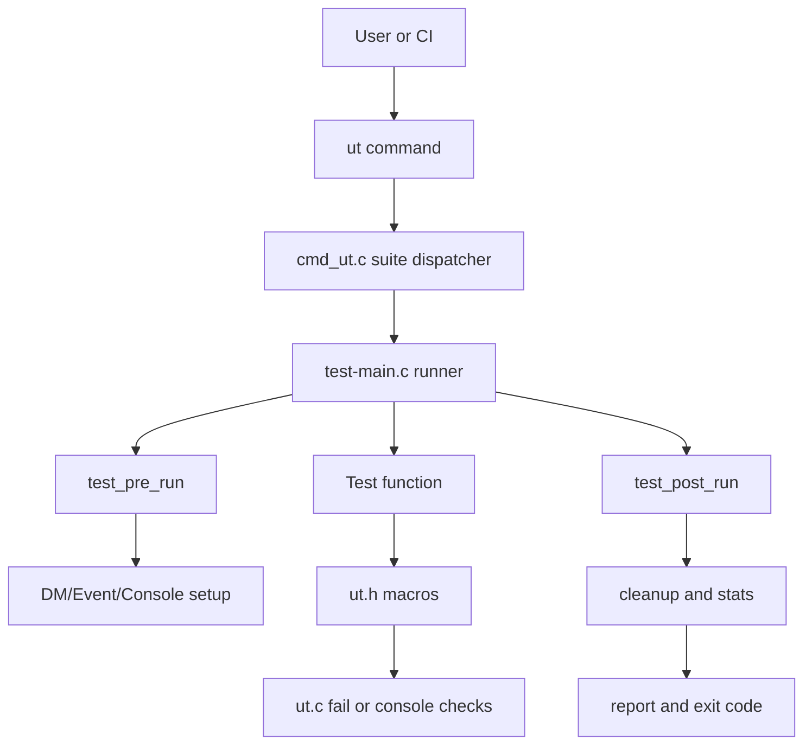
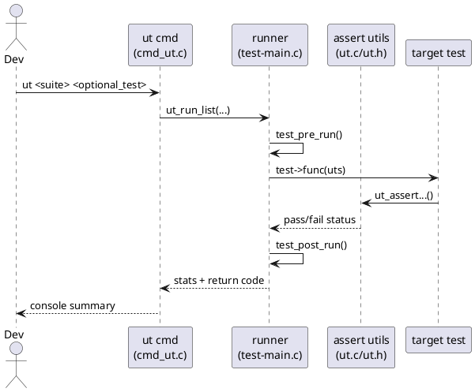
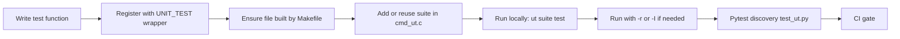
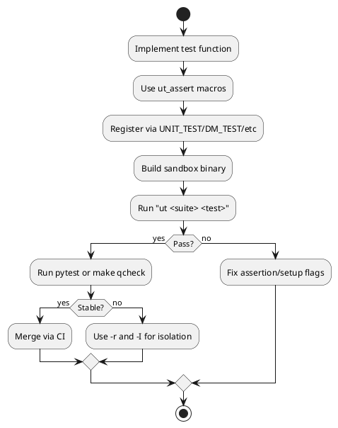

# U-Boot UT Know-How (First Principles)

## Ghi chú phạm vi

Bạn yêu cầu `./u-boot/tests/ut.c`, nhưng trong repo hiện tại file lõi là [u-boot/test/ut.c](u-boot/test/ut.c).

---

## 1) Philosophy and Fundamentals

### Mục đích tồn tại của module UT

`ut.c` không phải là test runner đầy đủ. Nó là **assertion/runtime utility layer** cho hệ thống unit test C của U-Boot:

- Ghi nhận failure theo định dạng nhất quán.
- Kiểm soát console capture/decode để so sánh output command.
- Hỗ trợ memory leak checks (`ut_check_free`, `ut_check_delta`).
- Điều khiển im/lặng output để test có tính quyết định.

### Bài toán cốt lõi mà nó giải quyết

Nếu không có lớp này, mỗi test file sẽ:

- Tự viết logic assert.
- Tự parse output console.
- Tự thu thập và report fail counter.

Kết quả là không đồng nhất và khó tự động hóa. `ut.c` cung cấp một "toán tử chung" cho phép test function chỉ tập trung vào intent kiểm thử.

### Nguyên lý nền tảng

1. **Determinism**: test phải có output nhất quán.
2. **Isolation**: test state được reset pre/post.
3. **Minimal overhead**: assert macro + linker-list registration.
4. **Machine-consumable**: pytest có thể phát hiện/rerun test tương ứng.

---

## 2) Kiến trúc hệ thống test C trong U-Boot

## 2.1 Main components

| Thành phần | Vai trò | File chính |
|---|---|---|
| Assertion utilities | fail/report/console checks/memory delta | [u-boot/test/ut.c](u-boot/test/ut.c), [u-boot/include/test/ut.h](u-boot/include/test/ut.h) |
| Test metadata model | `unit_test`, `unit_test_state`, flags | [u-boot/include/test/test.h](u-boot/include/test/test.h) |
| Runner core | pre-run/post-run, DM reset, run list | [u-boot/test/test-main.c](u-boot/test/test-main.c) |
| Command bridge | lệnh `ut` + suite dispatch | [u-boot/test/cmd_ut.c](u-boot/test/cmd_ut.c) |
| Build wiring | test object linking theo phase | [u-boot/test/Makefile](u-boot/test/Makefile) |
| Pytest automation | auto-discover và gọi `ut` | [u-boot/test/py/tests/test_ut.py](u-boot/test/py/tests/test_ut.py) |

## 2.2 Kiến trúc luồng gọi



## 2.3 PlantUML sequence



---

## 3) Workflow thuc thi du lieu

## 3.1 Data objects

- `struct unit_test`: metadata của 1 test (name, func, flags).
- `struct unit_test_state`: state runtime xuyên suốt (stats, DT mode, buffers, etc.).
- `struct ut_stats`: counters fail/skip/test/duration.

## 3.2 Lifecycle

1. `ut` command nhận suite và filter.
2. Suite map ra linker-list (`UNIT_TEST`, `UNIT_TEST_INIT`, `UNIT_TEST_UNINIT`).
3. `ut_run_list()` chuẩn bị state và detect DM requirements.
4. Mỗi test:
   - `test_pre_run()` setup event/DM/console record/FDT mode.
  - gọi test function.
  - assertion bắt lỗi qua `ut_fail`/`ut_failf`.
   - `test_post_run()` cleanup.
5. Tổng hợp report + mã thoát.

### Công thức tổng quát

Nếu có `N` tests và mỗi test chạy `r` lần:

$$
T_{total} \approx \sum_{i=1}^{N}\left(T_{setup,i} + r\cdot T_{body,i} + T_{cleanup,i}\right)
$$

`UTF_DM` làm tăng chi phí setup nhưng đổi lại tính isolated cao hơn.

---

## 4) Module này tương tác với U-Boot như thế nào

## 4.1 Tương tác với console subsystem

- `ut_check_console_line()` đọc output từ `console_record_readline()`.
- Cần `UTF_CONSOLE` + `console_record_reset_enable()` trong pre-run.
- Dùng để test command behavior một cách machine-checkable.

## 4.2 Tương tác với Driver Model (DM)

- `UTF_DM` kích hoạt `dm_test_pre_run()` / `dm_test_post_run()`.
- Mỗi test DM được reset model state để tránh side effect.
- Hỗ trợ run trên live tree và flat tree.

## 4.3 Tương tác với global runtime

- Tác động `gd->flags` để unsilence output khi fail.
- Cho phép quản lý bloblist, event framework, cyclic jobs, blkcache.
- Đảm bảo test không phá vỡ trạng thái runtime cho test kế tiếp.

## 4.4 Tương tác với build/link system

- Macro `UNIT_TEST()` tạo linker-list entry.
- `cmd_ut.c` SUITE_DECL/SUITE map suite name sang đoạn linker-list.
- `test/Makefile` quyết định object nào được build theo Kconfig/phase.

---

## 5) Cách tạo test mới (thực hành)

## 5.1 Add test vào suite có sẵn

1. Tìm file suite, ví dụ [u-boot/test/boot/bootm.c](u-boot/test/boot/bootm.c).
2. Viết function:

```c
static int bootm_test_new_case(struct unit_test_state *uts)
{
    ut_assertok(run_command("echo hello", 0));
    return 0;
}
BOOTM_TEST(bootm_test_new_case, UTF_CONSOLE);
```

3. Đảm bảo file đó đang được build trong Makefile.

## 5.2 Tạo suite mới

1. Tạo file test mới, define macro suite wrapper:

```c
#define WIBBLE_TEST(_name, _flags) UNIT_TEST(_name, _flags, wibble_test)
```

2. Thêm tests bằng `WIBBLE_TEST(...)`.
3. Đăng ký suite trong [u-boot/test/cmd_ut.c](u-boot/test/cmd_ut.c):
   - `SUITE_DECL(wibble);`
   - `SUITE(wibble, "...description...")`
4. Thêm object vào Makefile phù hợp.

## 5.3 Chọn flags đúng

- `UTF_CONSOLE`: cần capture output command.
- `UTF_DM`: test liên quan driver model.
- `UTF_SCAN_FDT`: cần bind devices từ DT.
- `UTF_MANUAL`: test chỉ chạy khi `ut -f`; tên test phải kết thúc `_norun`.

---

## 6) Automation với UT

## 6.1 Local fast loop

- Chạy all suites:

```bash
./u-boot -T -c "ut all"
```

- Chạy một suite:

```bash
./u-boot -T -c "ut dm"
```

- Chạy một test:

```bash
./u-boot -T -c "ut dm dm_test_gpio"
```

- Stress race (`-r`):

```bash
./u-boot -T -c "ut dm -r100 dm_test_rtc_set_get"
```

- Isolate cross-test pollution (`-I`):

```bash
./u-boot -T -c "ut dm -I82:dm_test_host"
```

## 6.2 Pytest integration

- Unit tests C được pytest thu thập và gọi thông qua [u-boot/test/py/tests/test_ut.py](u-boot/test/py/tests/test_ut.py).
- Command tổng:

```bash
make check
```

- Quick subset:

```bash
make qcheck
```

## 6.3 CI strategy đề xuất

1. Stage 1: `ut info` sanity + selected critical suites (`dm,bootstd,bootm`).
2. Stage 2: `ut all` tren sandbox test DT (`-T`).
3. Stage 3: pytest (`make qcheck` mỗi commit, `make check` theo lịch/nightly).
4. Stage 4: flaky detector với `-rN` cho test có lịch sử race.

---

## 7) Diagram tạo test mới và automation





---

## 8) Practical checklist

- Test name theo convention: `<suite>_test_<case>`.
- Chọn UTF flags đúng, đặc biệt `UTF_DM` và `UTF_SCAN_FDT`.
- Nếu test manual: thêm `UTF_MANUAL` và hậu tố `_norun`.
- Test output command: bắt buộc `UTF_CONSOLE` + `ut_assert_nextline...`.
- Luôn chạy lại với `-T` trên sandbox trước khi đẩy CI.
